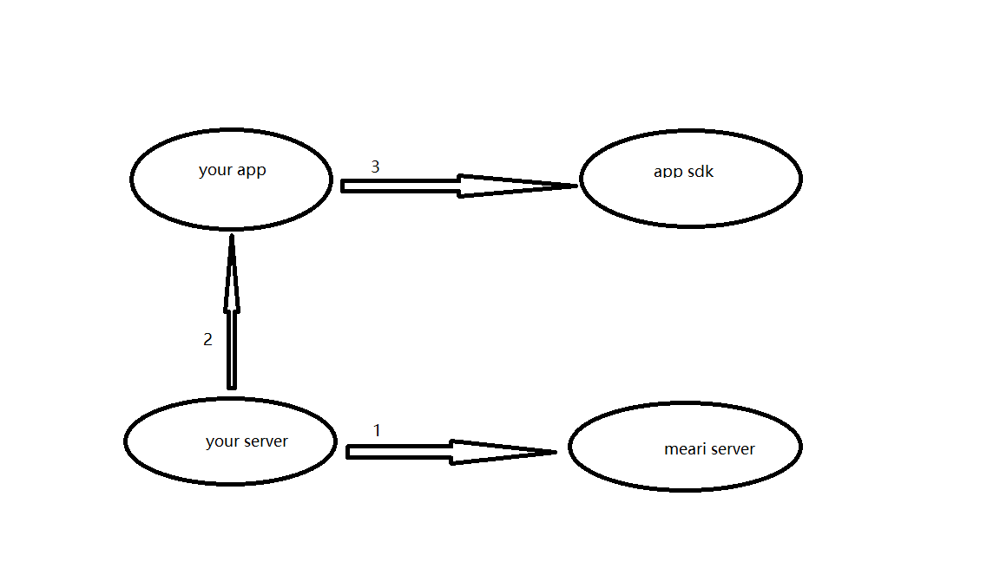

### How to integrate with Mearisdk

1. Your server uses the domain  name <https://apis.cloudedge360.com>  to call the redirect interface and get redirect response parameters. Call the login interface with the response parameter apiServer of the redirect interface as the domain name, and get the login response parameter.(The redirect interface and login interface are in this document <https://github.com/Mearitek/MeariSdk/blob/MeariSdk-3.1.0/Server/server%20to%20server.md>)

   

2. The redirect response parameters and login response parameters obtained by your server are passed to your app.

   

3. Your app passes the redirect response parameters and login response parameters into the Android SDK method loginWithExternalData(String redirectionJson, String loginJson, ILoginCallback callback), and the login is successful.

   

4. Follow the app sdk guide: <https://github.com/Mearitek/MeariSdk/blob/MeariSdk-3.1.0/Android/docs/Meari%20Android%20SDK%20Guide.md>

