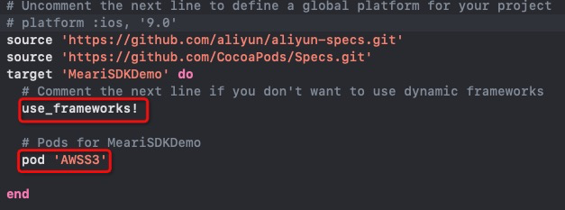

# 目录
* 1 [功能概述](#1-功能概述)
* 2 [集成准备](#2-集成准备)
* 3 [集成SDK](#3-集成SDK)
    * 3.1 [工程中引入Framework](#31-工程中引入Framework)
    * 3.2 [环境配置](#32-环境配置)
    * 3.3 [添加依赖库](#33-添加依赖库)
    * 3.4 [初始化SDK](#34-初始化SDK)
* 4 [用户管理](#4-用户管理)
    * 4.1 [用户登录](#41-用户登录)
    * 4.2 [用户登出](#42-用户登出)
    * 4.3 [用户上传头像](#43-用户上传头像)
    * 4.4 [修改昵称](#44-修改昵称)
    * 4.5 [注册消息推送](#45-注册消息推送)
    * 4.6 [数据模型](#46-数据模型)
    * 4.7 [消息通知](#47-消息通知)
* 5 [设备配网](#5-设备配网)
    * 5.1 [获取配网token](#51-获取配网token)
    * 5.2 [二维码配网](#52-二维码配网)
    * 5.3 [热点配网(Ap配网)](#53-热点配网(Ap配网))
    * 5.4 [有线配网](#54-有线配网)
* 6 [设备信息获取](#6-设备信息获取)
    * 6.1 [获取设备列表](#61-获取设备列表)
    * 6.2 [设备信息](#62-设备信息)
    * 6.3 [删除设备](#63-删除设备)
    * 6.4 [设备昵称修改](#64-设备昵称修改)
    * 6.5 [设备报警时间点](#65-设备报警时间点)
    * 6.6 [查询设备版本](#66-查询设备版本)
    * 6.7 [查询设备在线状态](#67-查询设备在线状态)
    * 6.8 [远程唤醒门铃](#68-远程唤醒门铃)
    * 6.9 [上传门铃留言](#69-上传门铃留言)
    * 6.10 [下载门铃留言](#610-下载门铃留言)
    * 6.11 [删除门铃留言](#611-删除门铃留言)
* 7 [设备控制](#7-设备控制)
    * 7.1 [连接设备](#71-连接设备)
    * 7.2 [断开设备](#72-断开设备)
    * 7.3 [获取码率](#73-获取码率)
    * 7.4 [预览](#74-预览)
    * 7.5 [回放](#75-回放)
        * 7.5.1 [回放相关](#751-回放相关)
        * 7.5.2 [设置回放时长](#752-设置回放时长)
    * 7.6 [云回放](#76-云回放)
    * 7.7 [静音](#77-静音)
    * 7.8 [语音对讲](#78-语音对讲)
    * 7.9 [截图](#79-截图)
    * 7.10 [录像](#710-录像)
    * 7.11 [获取设备所有参数](#711-获取设备所有参数)
    * 7.12 [云台控制](#712-云台控制)
    * 7.13 [留言](#713-留言)
    * 7.14 [侦测报警](#714-侦测报警)
        * 7.14.1 [移动侦测](#7141-移动侦测)
        * 7.14.2 [人体侦测](#7142-人体侦测)
        * 7.14.3 [报警间隔](#7143-报警间隔)
    * 7.15 [存储(SD卡)](#715-存储(SD卡))
    * 7.16 [固件升级](#716-固件升级)
    * 7.17 [休眠模式](#717-休眠模式)
    * 7.18 [温湿度](#718-温湿度)
    * 7.19 [音乐](#719-音乐)
    * 7.20 [设备音量](#720-设备音量)
    * 7.21 [门铃音量](#721-门铃音量)
    * 7.22 [铃铛设置](#722-铃铛设置)
    * 7.23 [灯具摄像机设置](#723-灯具摄像机设置)
        * 7.23.1 [开关灯](#7231-开关灯)
        * 7.23.2 [报警器开关](#7232-报警器开关)
        * 7.23.3 [按时间段开灯](#7233-按时间段开灯)
        * 7.23.4 [按报警事件开关灯](#7234-按报警事件开关灯)
    * 7.24 [门铃接听流程](724-门铃接听流程)
* 8[设备分享](#8-设备分享) 
* 9[家庭](#9-家庭)
    * 9.1 [家庭管理](#91-家庭管理)
        * 9.1.1 [获取家庭房间列表(不包含设备信息)](#911-获取家庭房间列表(不包含设备信息))
        * 9.1.2 [获取家庭房间列表(包含设备信息)](#912-获取家庭房间列表(包含设备信息))
        * 9.1.3 [新建家庭](#913-新建家庭)
        * 9.1.4 [更新家庭信息](#914-更新家庭信息)
        * 9.1.5 [删除家庭](#915-删除家庭)
    * 9.2 [家庭分享](#92-家庭分享)
        * 9.2.1 [加入家庭](#921-加入家庭)
        * 9.2.2 [离开家庭](#922-离开家庭)
        * 9.2.3 [邀请成员加入家庭组](#923-邀请成员加入家庭组)
        * 9.2.4 [撤销邀请成员](#924-撤销邀请成员)
        * 9.2.5 [家庭移除成员](#925-家庭移除成员])
        * 9.2.6 [家庭添加成员根据账号搜索](#926-家庭添加成员根据账号搜索)
        * 9.2.7 [家庭成员列表](#927-家庭成员列表)
        * 9.2.8 [家庭设备权限变更](#928-家庭设备权限变更)
        * 9.2.9 [家庭成员名称修改](#929-家庭成员名称修改)
    * 9.3 [房间操作](#93-房间操作)
        * 9.3.1 [设备分配房间](#931-设备分配房间)
        * 9.3.2 [新增房间](#932-新增房间)
        * 9.3.3 [房间名称修改](#933-房间名称修改)
        * 9.3.4 [删除房间](#934-删除房间)
        * 9.3.5 [移除房间的设备](#935-移除房间的设备)
* 10 [消息](#10-消息)
    * 10.1 [获取所有设备是否有消息](#101-获取所有设备是否有消息)
    * 10.2 [报警消息](#102-报警消息) 
        * 10.2.1 [获取某个设备报警消息](#1021-获取某个设备报警消息)
        * 10.2.2 [获取用户所拥有设备最新的一条报警消息列表](#1022-获取用户所拥有设备最新的一条报警消息列表)
        * 10.2.3 [获取有报警消息的天数(最近7天)](#1023-获取有报警消息的天数(最近7天))
        * 10.2.4 [获取设备某天的报警消息](#1024-获取设备某天的报警消息)
        * 10.2.5 [加载报警图片](#1025-加载报警图片)
        * 10.2.6 [批量删除多个设备报警消息](#1026-批量删除多个设备报警消息)
    * 10.3 [系统消息](#103-系统消息)
        * 10.3.1 [获取系统消息](#1031-获取系统消息)
        * 10.3.2 [批量删除系统消息](#1032-批量删除系统消息)
    * 10.4 [分享消息](#104-分享消息)
        * 10.4.1 [获取设备分享消息列表](#1041-获取设备分享消息列表)
        * 10.4.2 [删除设备分享消息](#1042-删除设备分享消息)
        * 10.4.3 [获取家庭分享消息列表](#1043-获取家庭分享消息列表)
        * 10.4.4 [删除家庭分享消息](#1044-删除家庭分享消息)
        * 10.4.5 [处理家庭分享消息](#1045-处理家庭分享消息)
* 11 [云存储服务](#10-云存储服务)
    * 11.1 [云存储服务状态](#111-云存储服务状态)
    * 11.2 [云存储试用](#112-云存储试用)
    * 11.3 [云存储激活码](#113-云存储激活码)
    * 11.4 [云存储购买](#114-云存储购买)
* 12 [NVR](#12-NVR)
    * 12.1 [添加NVR](#121-添加NVR)
    * 12.2 [添加摄像机到NVR通道](#122-添加摄像机到NVR通道)
        * 12.2.1 [添加在线摄像机](#1221-添加在线摄像机)
        * 12.2.2 [连接NVR添加摄像机](#1222-连接NVR添加摄像机)
        * 12.2.3 [连接路由器添加摄像机](#1223-连接路由器添加摄像机)
    * 12.3 [NVR和通道的判断](#123-NVR和通道的判断)
    * 12.4 [NVR设置](#124-NVR设置)
        * 12.4.1 [NVR获取参数](#1241-NVR获取参数)
        * 12.4.2 [NVR磁盘管理](#1242-NVR磁盘管理)
    * 12.5 [NVR通道摄像机](#125-NVR通道摄像机)
        * 12.5.1 [NVR通道摄像机信息](#1251-NVR通道摄像机信息)
        * 12.5.2 [NVR删除通道摄像机](#1252-NVR删除通道摄像机)
        * 12.5.3 [NVR通道摄像机固件升级](#1253-NVR通道摄像机固件升级)
<center>

---
| 版本号 | 制定团队 | 更新日期 | 备注 | 
| ------ | ------ | ------ | ------ |
| 2.0.1 | 觅睿技术团队 | 2019.06.25 | 优化
| 3.1.0 | 觅睿技术团队 | 2021.07.05 | 优化
| 4.1.0 | 觅睿技术团队 | 2022.03.23 | 家庭
| 4.4.0 | 觅睿技术团队 | 2022.06.08 | NVR
</center>

# 1. 功能概述 

觅睿科技APP SDK提供了与硬件设备、觅睿云通讯的接口封装，加速应用开发过程，主要包括以下功能：
- 账号体系 (登录、登出、修改用户信息、注册推送等通用账号功能) 
- 硬件设备相关 (配网、控制、状态上报、固件升级、预览回放等功能) 
- 云存储服务(获取开通状态、开通服务、创建订单、订单列表等功能) 
- 家庭组相关 (新建家庭组、新建房间、分配房间、邀请成员等功能) 
- 消息中心（报警消息、设备分享消息、家庭分享消息、系统消息）

# 2. 集成准备

 请先阅读服务端文档，获取重定向和登录的认证信息后进行下一步

# 3. 集成SDK 

## 3.1 工程中引入Framework  

```
 将MeariKit.framework 添加到 target -> General -> Embedded Binaries 或者 target -> General -> Framework,Libraries, and Embedded Content
```

## 3.2 环境配置  

```
禁用bitcode：在工程面板中，选中target -> Build Settings -> Build Options -> Enable Bitcode -> 设为 No
```

## 3.3 添加依赖库 
```
使用cocospod 引入framework所需要的AWSS3 ，如下所示
```

## 3.4 初始化SDK

```
所属：MeariSdk工具类
```
```
【描述】
      通过云云对接后，从服务器 v2/third/sdk/redirect 中获取的数据传入并初始化SDK.
【函数调用】

- (void)startSDKWithRedirectInfo:(NSDictionary *)info;

【代码范例】
       [[MeariSDK sharedInstance] startSDKWithRedirectInfo:@{}]; 
```


# 4. 用户管理 

```
所属：MeariUser工具类
```
```
觅睿科技SDK提供一种用户管理体系：UID用户体系 
Demo工程中中有一份phoneCode文件 存储了对应的国家代码和电话代码
```

## 4.1 用户登录 

```
【描述】
     通过云云对接后，从服务器v2/third/sdk/login 中获取的数据传入SDK，实现登录操作。
     注意：在每次调用loginUidWithExtraParamInfo之前，需要先调用 startSDKWithRedirectInfo 方法
【函数调用】
     /**
      @param info 用户登录信息 有云云对接之后 从服务器端获取
     */
     - (void)loginUidWithExtraParamInfo:(NSDictionary *)info complete:(void(^)(NSError *error))complete;

【代码范例】
    [[MeariUser sharedInstance] loginUidWithExtraParamInfo:dic complete:^(NSError *error) {
        if (!error) {
            NSLog(@"login Success");
        }else {
            NSLog(@"login error --- %@",error.description);
        }
    }];

```

## 4.2 用户登出 

```
【描述】
     账号登出
【函数调用】
     /**
      @param success 成功回调
      @param failure 失败回调
     */
    - (void)logoutSuccess:(MeariSuccess)success failure:(MeariFailure)failure;
【代码范例】
     [[MeariUser sharedInstance] logoutSuccess:^{

     } failure:^(NSError *error) {

     }];
```
## 4.3 用户上传头像 

```
【描述】
     用户上传头像
 
【函数调用】
     /*
      @param image 图片
      @param success 成功回调，返回头像的url
      @param failure 失败回调
      */
     - (void)uploadUserAvatarWithImage:(UIImage *)image success:(MeariSuccess_Avatar)success failure:(MeariFailure)failure;
        
【代码范例】
     [[MeariUser sharedInstance] uploadUserAvatarWithImage:[UIImage imageWithData:self.imageData] success:^(NSString *avatarUrl) {

     } failure:^(NSError *error) {
    
     }];
```
## 4.4 修改昵称

```
【描述】
     修改用户昵称。
 
【函数调用】
     /*
      @param name 新的昵称，长度6-20位
      @param success 成功回调
      @param failure 失败回调
     */
    - (void)renameNicknameWithName:(NSString *)name  success:(MeariSuccess)success failure:(MeariFailure)failure;
        
【代码范例】
     [[MeariUser sharedInstance] renameNicknameWithName:newName success:^{
    
     } failure:^(NSError *error) {
    
     }];
```
## 4.5 注册消息推送

```
【描述】
     注册Meari消息推送 
     需要向我们服务器提供P8文件，P8文件的Key ID,App的bundle ID,App发布证书的Team ID 才能实现推送APNS消息。
     在已经登录的情况下调用 即在[MeariUser sharedInstance].logined == YES的条件下

【函数调用】
     @param deviceToken 手机token 
     @param success 成功回调
     @param failure 失败回调
     - (void)registerPushWithDeviceToken:(NSData *)deviceToken success:(MeariSuccess_Dictionary)success failure:(MeariFailure)failure;
【代码范例】

     [[MeariUser sharedInstance] registerPushWithDeviceToken:tokenData 	success:^(NSDictionary *dict) {

     } failure:^(NSError *error) {
             
     }];


【描述】
     关闭推送声音
【函数调用】
     /**
      Sound push
      声音推送

     @param openSound whether to open ( 是否开启)
     @param success Successful callback (成功回调)
     @param failure failure callback (失败回调)
   
     */

    - (void)notificationSoundOpen:(BOOL)openSound success:(MeariSuccess)success failure:(MeariFailure)failure;
【代码范例】
     [[MeariUser sharedInstance] notificationSoundOpen:YES success:^{

     } failure:^(NSError *error) {

     }];

【描述】
	 关闭设备的推送
【函数调用】
    /**
     Device push(设备推送)
     @param deviceID 设备ID
     @param enable (whether to open)开关 shif
     @param success Successful callback (成功回调)
     @param failure failure callback (失败回调)
     */
【代码范例】

```

## 4.6 数据模型 

用户相关的数据模型。

```
【MeariUserInfo】
@property (nonatomic, strong) NSString * avatarUrl;     // 用户头像
@property (nonatomic, strong) NSString * nickName;      // 用户昵称
@property (nonatomic, strong) NSString * userAccount;   // 用户账号
@property (nonatomic, strong) NSString * userID;        // 用户ID
@property (nonatomic, strong) NSString * loginTime;     // 用户登录时间
@property (nonatomic, strong) NSString * pushAlias;     // 用户推送别名 无效
@property (nonatomic, strong) NSString * token;         // 用户有效标识
@property (nonatomic, strong) NSString * secrect;       // 用户有效标识
@property (nonatomic, strong) NSString * userKey;       // 用户key
@property (nonatomic, strong) NSString * userName;      // 用户名称
@property (nonatomic, strong) NSString * countryCode;   // 注册国家代号
@property (nonatomic, strong) NSString * phoneCode;     // 注册国家手机代号
@property (nonatomic, assign) NSInteger loginType;      // 登录类型
@property (nonatomic, strong) NSString * appleID;       // 苹果apple id
@property (nonatomic, assign) BOOL notificationSound;   // 消息推送是否有声音
@property (nonatomic, assign, readonly) MeariThirdLoginType thirdLoginType; 第三方登录类型
```
## 4.7 消息通知 

```
及时消息通知是MeariSDK及时通知App端当前用户和用户账户下设备的一些状态，以方便App端实现更好的用户体验

【通知类型】参见：MeariUser.h
    MeariUserLoginInvalidNotification     (登录信息失效，需要重新登录)
    MeariDeviceCancelSharedNotification   (设备被取消分享)
    MeariDeviceNewShareToMeNotification  （别人将他自己的设备分享给我）
    MeariDeviceNewShareToHimNotification （别人请求将我的设备分享给他）
    MeariUserNoticeNotification           (接收到通知公告消息)
    MeariDeviceUnbundlingNotification     (设备被解绑)
    MeariDeviceHasVisitorNotification     (设备(门铃)有访客)
    MeariDeviceHasBeenAnswerCallNotification  (设备(门铃)已经被接听)
    MeariIotDeviceOnlineNotification      （Meari iot设备上下线通知）
   
【使用】
    [[NSNotificationCenter defaultCenter] addObserver:self selector:@selector(userLoginInvalidNotification:) name:MeariUserLoginInvalidNotification object:nil];
```

# 5. 设备配网

```
所属：MeariDeviceActivator工具类

觅睿科技硬件模块支持三种配网模式：二维码配网模式、热点模式 (AP模式)、有线配网。
大致流程为- 获取配网tokon - 将token以及wifi信息给到设备 - 等待设备添加成功。各个模式的主要区别在于如何将配网信息给到设备，二维码通过摄像头扫码方式，热点模式通过WIFI链接传递，有线配网通过局域网搜索等。

```


## 5.1 获取配网token
```
【描述】
     获取服务器上的配网Token,需要传递给设备
【函数调用】
     /** 
      token for config device (获取配网的token)
      @param success return  config dictionary
       token: config token 用于配网
       validTime: token invalid time token有效时长，超过时长需要重新获取新的token
       delaySmart: user for smartwifi (Deprecated)
      @param failure 失败回调
     */
    - (void)getTokenSuccess:(MeariSuccess_Token2)success failure:(MeariFailure)failure;

【代码范例】
    [[MeariDeviceActivator sharedInstance] getTokenSuccess:^(NSString *token, NSInteger validTime, NSInteger delaySmart) {
        
    } failure:^(NSError *error) {

    }];

```
## 5.2 二维码配网
```
【描述】
     将WIFI信息,配网token 生成二维码 给设备扫描。
     在设备发出布谷的声音之后表明识别成功，设备会进入红灯快闪的状态
【函数调用】
     /**
      @param ssid wifi name(wifi名称)
      @param password wifi password(wifi密码)
      @param token code token(二维码token)
      @param size QR code size(二维码大小)
      @param subDevice Sub device (是否为添加子设备)
      @return QR code image(二维码图片)
     */
     - (UIImage *)createQRCodeWithSSID:(NSString *)ssid pasword:(NSString *)password token:(NSString *)token addSubDevice:(BOOL)subDevice size:(CGSize)size;

【代码范例】
    UIImage *image = [[MeariDeviceActivator sharedInstance] createQRCodeWithSSID:@"Meari" pasword:@"12345678" token:token addSubDevice:NO size:CGSizeMake(300, 300)];

【描述】
      等待设备自动添加成功的消息，建议手动查询设备列表，避免消息送达不及时的情况。
【代码范例】
    1.[MeariDeviceActivator sharedInstance].delegate = self;
     实现代理方法
      - (void)activator:(MeariDeviceActivator *)activator didReceiveDevice:(MeariDevice *)deviceModel error:(NSError *)error {
         NSLog(@"配网的设备 --- netConnect  ------ %@ 设备添加状态 -------- %ld",deviceModel.info.nickname,(long)deviceModel.info.addStatus);
         if (deviceModel.info.addStatus == MeariDeviceAddStatusSelf) {
           NSLog(@"设备配网成功");
         }
      }

    2.在给设备扫描二维码之前先记录下设备列表的设备, 等待设备添加成功的回调时，可以主动调用获取设备列表的接口来检查是否有新的设备加入
    [[MeariUser sharedInstance] getDeviceListSuccess:^(MeariDeviceList *deviceList) {

    } failure:^(NSError *error) {

    }];

    如果想搜索局域网里的其他设备 可以调用 

    [MeariDeviceActivator sharedInstance].delegate = self;
    [[MeariDeviceActivator sharedInstance] startConfigWiFi:MeariSearchModeAll token:token type:MeariDeviceTokenTypeQRCode nvr:NO timeout:100];
	
    在上面的代理方法中会出现局域网中的设备

	停止局域网搜索其他设备
    [[MeariDeviceActivator sharedInstance] stopConfigWiFi];

```
## 5.3 热点配网(Ap配网)
```
【描述】
     将WIFI信息、配网token生成二维码, 通过热点WIFI透传给设备。
     需要手机端连接到设备发出的热点之下, 热点前缀为STRN_xxxxxxxxx 
     调用成功之后, 设备会发出布谷的声音, 然后进入蓝灯快闪的状态
【函数调用】
     /**
      @param ssid wifi name (wifi名称)
      @param password wifi password (wifi密码)
      @param token config token (获取的配网APtoken)
      @param success Successful callback (成功回调)
      @param failure failure callback (失败回调)
     */
    - (void)configApModeWithSSID:(NSString *)ssid password:(NSString *)password token:(NSString *)token relay:(BOOL)relayDevice success:(MeariSuccess)success failure:(MeariFailure)failure;
【代码范例】
     [[MeariDeviceActivator sharedInstance] configApModeWithSSID:@"Meari" password:@"12345678"  token:token relay:NO success:^{
        NSLog(@"device connect network success);
     } failure:^(NSError *error) {

     }];

【描述】
      等待设备自动添加成功的消息，建议手动查询设备列表，避免消息送达不及时的情况。
【代码范例】
    1.[MeariDeviceActivator sharedInstance].delegate = self;
     实现代理方法
      - (void)activator:(MeariDeviceActivator *)activator didReceiveDevice:(MeariDevice *)deviceModel error:(NSError *)error {
         NSLog(@"配网的设备 --- netConnect  ------ %@ 设备添加状态 -------- %ld",deviceModel.info.nickname,(long)deviceModel.info.addStatus);
         if (deviceModel.info.addStatus == MeariDeviceAddStatusSelf) {
           NSLog(@"设备配网成功");
         }
      }

    2.在给设备扫描二维码之前先记录下设备列表的设备, 等待设备添加成功的回调时，可以主动调用获取设备列表的接口来检查是否有新的设备加入
    [[MeariUser sharedInstance] getDeviceListSuccess:^(MeariDeviceList *deviceList) {

    } failure:^(NSError *error) {

    }];

    如果想搜索局域网里的其他设备 可以调用 

    [MeariDeviceActivator sharedInstance].delegate = self;
    [[MeariDeviceActivator sharedInstance] startConfigWiFi:MeariSearchModeAll token:token type:MeariDeviceTokenTypeAP nvr:NO timeout:100];
	
    在上面的代理方法中会出现局域网中的设备
	
    停止局域网搜索其他设备
    [[MeariDeviceActivator sharedInstance] stopConfigWiFi];

```
## 5.4 有线配网
```
【描述】
     确保设备插入网线,手机和设备处于同一个局域网之内
     在同一个局域网内搜索设备

【函数调用】
     /**
      @param mode search mode 搜索模式
      @param success Successful callback (成功回调)
      @param failure failure callback (失败回调)
     */
     - (void)startSearchDevice:(MeariDeviceSearchMode)mode success:(MeariDeviceSuccess_SearchDevice)success failure:(MeariDeviceFailure)failure;
【代码范例】
	 // device.info.wireDevice == YES 有线设备 
	 // device.info.wireConfigIp 有线设备的透传地址 
     [[MeariDeviceActivator sharedInstance] startSearchDevice:MeariSearchModeLan success:^(MeariDevice *device) {
      NSLog(@"返回的设备 ------ %@ 设备添加状态 -------- %ld", deviceModel.info.nickname,deviceModel.info.addStatus);
        if (device.info.wireDevice) {
			
        }
      } failure:^(NSError *error) {
        
      }];

	 // 停止搜索局域网设备
    [[MeariDeviceActivator sharedInstance] stopSearchDevice];

【描述】
     向服务器查询设备的添加状态 过滤一些不符合的设备
【函数调用】
     /**
      @param devices device array 设备数组
      @param success Successful callback (成功回调)
      @param failure failure callback (失败回调)
     */
     - (void)checkDeviceStatus:(NSArray <MeariDevice *>*)devices success:(MeariSuccess_DeviceListForStatus)success failure:(MeariFailure)failure;
【代码范例】
      [[MeariDeviceActivator sharedInstance] checkDeviceStatus:@[device] success:^(NSArray<MeariDevice *> *devices) {
            for (MeariDevice *device in devices) {
                if (device.info.addStatus == MeariDeviceAddStatusNone){
                    NSLog(@"未添加的设备")
                }
             }
               
        } failure:^(NSError *error) {
                
       }];


【描述】
     将配网token透传给设备
【函数调用】
     /**
      @param ip ip address  (设备ip地址)
      @param token config token (获取的配网token)
      @param success Successful callback (成功回调)
      @param failure failure callback (失败回调)
     */
      - (void)startConfigWireDevice:(NSString *)ip token:(NSString *)token success:(MeariSuccess)success failure:(MeariFailure)failure;
【代码范例】
     [[MeariDeviceActivator sharedInstance] startConfigWireDevice:device.info.wireConfigIp token:token success:^{
         NSLog(@"透传token成功")
     } failure:^(NSError *error) {
           
     }];

【描述】
      等待设备自动添加成功的消息，建议手动查询设备列表，避免消息送达不及时的情况。
【代码范例】
    1.[MeariDeviceActivator sharedInstance].delegate = self;
     实现代理方法
      - (void)activator:(MeariDeviceActivator *)activator didReceiveDevice:(MeariDevice *)deviceModel error:(NSError *)error {
         NSLog(@"配网的设备 --- netConnect  ------ %@ 设备添加状态 -------- %ld",deviceModel.info.nickname,(long)deviceModel.info.addStatus);
         if (deviceModel.info.addStatus == MeariDeviceAddStatusSelf) {
           NSLog(@"设备配网成功");
         }
      }

    2.在给设备扫描二维码之前先记录下设备列表的设备, 等待设备添加成功的回调时，可以主动调用获取设备列表的接口来检查是否有新的设备加入
    [[MeariUser sharedInstance] getDeviceListSuccess:^(MeariDeviceList *deviceList) {

    } failure:^(NSError *error) {

    }];

```
# 6. 设备信息获取
```
所属：MeariUser
```
## 6.1 获取设备列表 

```
返回：MeariDeviceList
```
```
【描述】
     设备添加后，通过MeariUser工具类的接口获取设备列表，以模型形式返回
设备信息为设备对象的info属性 (MeariDeviceInfo) 

【函数调用】
    //获取所有设备列表
    - (void)getDeviceListSuccess:(MeariSuccess_DeviceList)success failure:(MeariFailure)failure;

【代码范例】
     [[MeariUser sharedInstance] getDeviceListSuccess:^(MeariDeviceList *deviceList) {

     } failure:^(NSError *error) {

     }];
```

MeariDeviceList属性：

```
 /** 摄像机 */
@property (nonatomic, strong) NSArray <MeariDevice *> *ipcs;
/** 智能门铃 */
@property (nonatomic, strong) NSArray <MeariDevice *> *bells;
/** 语音门铃 */
@property (nonatomic, strong) NSArray <MeariDevice *> *voicebells;
/** 电池摄像机 */
@property (nonatomic, strong) NSArray <MeariDevice *> *batteryIpcs;
/** 灯具摄像机 */
@property (nonatomic, strong) NSArray <MeariDevice *> *lights;
/** 网络存储器 */
@property (nonatomic, strong) NSArray <MeariDevice *> *nvrs;
/** 中继 */
@property (nonatomic, strong) NSArray <MeariDevice *> *chimes;
```
## 6.2 设备信息 

```
所属：MeariDevice
```
```
@property (nonatomic, strong) MeariDeviceInfo *info;                        //设备信息
@property (nonatomic, strong) MeariDeviceParam *param;                      //设备参数
@property (nonatomic, assign, readonly, getter=isIpcCommon)BOOL ipcCommon;  //是否是普通摄像机
@property (nonatomic, assign, readonly, getter=isIpcBaby)BOOL ipcBaby;      //是否是音乐摄像机
@property (nonatomic, assign, readonly, getter=isIpcBell)BOOL ipcBell;      //是否是门铃摄像机
@property (nonatomic, assign, readonly, getter=isNvr)BOOL nvr;              //是否是NVR
@property (nonatomic, assign)BOOL hasBindedNvr;                             //是否绑定
@property (nonatomic, assign, readonly)BOOL sdkLogined;                     //是否已经链接设备
@property (nonatomic, assign, readonly)BOOL sdkLogining;                    //是否正在链接设备
@property (nonatomic, assign, readonly)BOOL sdkPlaying;                     //是否正在预览
@property (nonatomic, assign, readonly)BOOL sdkPlayRecord;                  //是否正在回放
@property (nonatomic, strong)NSDateComponents *playbackTime;                //当前回放时间
@property (nonatomic, assign, readonly)BOOL supportFullDuplex;              //是否支持双向语音对讲
@property (nonatomic, assign, readonly)BOOL supportVoiceTalk;               //是否支持语音对讲
。。。
```
## 6.3 删除设备 

```
【描述】
     设备移除

【函数调用】
      /**
       @param type 设备类型
       @param deviceID 设备ID
       @param success 成功回调
       @param failure 失败回调
     */
     - (void)deleteDeviceWithDeviceType:(MeariDeviceType)type deviceID:(NSInteger)deviceID success:(MeariSuccess)success failure:(MeariFailure)failure;

【代码范例】
     [[MeariUser sharedInstance] deleteDeviceWithDeviceType:MeariDeviceTypeIpc deviceID:cell.camera.info.ID success:^{

     } failure:^(NSError *error) {

     }];
```

## 6.4 设备昵称修改 

```
【描述】
    设备昵称修改

【函数调用】
     /**
       @param type 设备类型
       @param deviceID 设备ID
       @param nickname 新的昵称，长度6-20位
       @param success 成功回调
       @param failure 失败回调
     */
     - (void)renameDeviceWithType:(MeariDeviceType)type deviceID:(NSInteger)deviceID nickname:(NSString *)nickname success:(MeariSuccess)success failure:(MeariFailure)failure;

【代码范例】
     [[MeariUser sharedInstance] renameDeviceWithType:MeariDeviceTypeIpc deviceID:self.camera.info.ID nickname:newNickName success:^{
    
     } failure:^(NSError *error) {
    
     }];
    
```

## 6.5 设备报警时间点

```
【描述】
     单个设备某天报警时间点获取
【函数调用】
     /**
      @param deviceID 设备ID
      @param channel  如果设备不是NVR子设备传入0
      @param date 日期：格式为20171212
      @param success 成功回调：返回报警时刻列表
      @param failure 失败回调
     */
     - (void)getAlarmMessageTimesWithDeviceID:(NSInteger)deviceID channel:(NSInteger)channel onDate:(NSString *)date success:(MeariSuccess_DeviceAlarmMsgTime)success failure:(MeariFailure)failure;

【代码范例】
     [[MeariUser sharedInstance] getAlarmMessageTimesWithDeviceID:self.device.info.ID channel:self.device.channel onDate:@"20171212" success:^(NSArray<NSString *> *time) {

     } failure:^(NSError *error) {

     }];
```

## 6.6 查询设备版本 

```
【描述】
     查询设备是否有新版本

【函数调用】
     /**
      @param deviceSn device SN(设备sn)
      @param tp device tp(设备的tp)
      @param currentFirmware Current version(当前版本)
      @param success Successful callback (成功回调): Returns the latest version information of the device(返回设备最新版本信息)
      @param failure failure callback (失败回调)
     */
     - (void)checkNewFirmwareWith:(NSString *)deviceSn tp:(NSString *)tp currentFirmware:(NSString *)currentFirmware success:(MeariSuccess_DeviceFirmwareInfo)success failure:(MeariFailure)failure;

【代码范例】
     [[MeariUser sharedInstance] checkNewFirmwareWithCurrentFirmware:self.currentVersion success:^(MeariDeviceFirmwareInfo *info) {
      
     } failure:^(NSError *error) {
    
     }];
```

MeariDeviceFirmwareInfo:

```
@property (nonatomic, copy) NSString *upgradeUrl;           //(设备升级地址)
@property (nonatomic, copy) NSString *latestVersion;        //(设备最新版本)
@property (nonatomic, copy) NSString *upgradeDescription;   //(设备升级描述)
@property (nonatomic, assign) BOOL needUpgrade;             //(是否需要升级)
@property (nonatomic, assign) BOOL forceUpgrade;            //(是否需要强制升级)

```

## 6.7 查询设备在线状态 

```
【描述】
     仅支持觅睿自研版本的设备，即[camera supportMeariIot] == YES 时才支持

【函数调用】
     /**
      @param 设备SN device.info.sn
      @return 返回是否在线 0为查询不到 1为在线 2为不在线 3为休眠
     */
     - (NSInteger)checkMeariIotDeviceOnlineStatus:(NSString *)deviceSN;
【代码范例】
     if ([camera supportMeariIot]) {
         NSInteger status = [[MeariUser  sharedInstance] checkMeariIotDeviceOnlineStatus:camera.info.sn];
        if (status == 0) {
            NSLog("设备不支持在线状态查询");
        }else if (status == 1){
            NSLog("设备在线");
        }else if (status == 2){
            NSLog("设备离线 ");
        }else if (status == 3){
            //只有低功耗设备才有的状态 camera.lowPowerDevice == YES
            NSLog("设备休眠");
        }
        
       //监听设备上下线的通知
       [NSNotificationCenter defaultCenter] addObserver:self selector:@selector(deviceOnlineChange:) name:MeariIotDeviceOnlineNotification object:nil];

       - (void)deviceOnlineChange:(NSNotification *)noti {
             NSDictionary *onlineDic = noti.object;
             NSString *deviceTag = onlineDic[@"deviceTag"];
             NSInteger status = [onlineDic[@"online"] integerValue];
            // ......

       }


```
## 6.8 远程唤醒门铃 

```
【描述】
     远程唤醒门铃

【函数调用】
     /**
      @param device 设备
      @param success 成功回调
      @param failure 失败回调
    */
    - (void)remoteWakeUpWithDevice:(MeariDevice *)device success:(MeariSuccess)success failure:(MeariFailure)failure;

【代码范例】
     [[MeariUser sharedInstance] remoteWakeUpWithDevice:device success:^{

     } failure:^(NSError *error) {

     }];
【注意事项】
     门铃类低功耗产品（camera.lowPowerDevice == YES），需要先调用远程唤醒接口，再调用打洞的接口
```

## 6.9 上传门铃留言 

```
【描述】
      上传门铃留言

【函数调用】
     /**
      @param deviceID 设备ID
      @param videoName 留言名称
      @param file 留言文件路径
      @param success 成功回调
      @param failure 失败回调
     */
     - (void)uploadVoiceWithDeviceID:(NSInteger)deviceID videoName:(NSString *)fileName voiceFile:(NSString *)file success:(MeariSuccess_DeviceVoiceMsg)success failure:(MeariFailure)failure

【代码范例】
     [[MeariUser sharedInstance] uploadVoiceWithDeviceID:device.info.ID videoName:videoName voiceFile:filePath success:^(MeariDeviceHostMessage *msg) {
        
     } failure:^(NSError *error) {

     }];
```

## 6.10 下载门铃留言 

```
【描述】
     下载门铃留言 将留言下载到指定位置

【函数调用】
     /**
      @param voiceUrl 留言地址
      @param filePath 留言本地文件路径
      @param success 成功回调，返回值：音频数据
      @param failure 失败回调
     */
     - (void)downloadVoiceWithVoiceUrl:(NSString *)voiceUrl filePath:(NSString *)filePath success:(MeariSuccess)success failure:(MeariFailure)failure;

【代码范例】
    [[MeariUser sharedInstance] downloadVoiceWithVoiceUrl:urlStr filePath:localPath success:^(void) {

    } failure:^(NSError *error) {
    
    }];
```

## 6.11 删除门铃留言 

```
【描述】
     删除门铃留言

【函数调用】
     /**
      @param deviceID 设备ID
      @param voiceID 留言ID
      @param success 成功回调
      @param failure 失败回调
     */
     - (void)deleteVoiceWithDeviceID:(NSInteger)deviceID voiceID:(NSString *)voiceID success:(MeariSuccess)success failure:(MeariFailure)failure;

【代码范例】
     [[MeariUser sharedInstance] deleteVoiceWithDeviceID:device.info.ID voiceID:voiceID success:^{

     } failure:^(NSError *error) {

     }];
```


# 7. 设备控制
```
所属：MeariDevice
```
```
MeariDevice 负责对设备的所有操作，包括预览、回放、设置等，对设备的设置，需要确保已经与设备建立好了连接
```
## 7.1 连接设备 

```
【描述】
     对设备进行预览、回放、设置等操作之前，需先连接上设备

【函数调用】
     /**
      @param success 成功回调
      @param disconnect 异常断开
      @param failure 失败回调
     */
     - (void)startConnectSuccess:(MeariDeviceSuccess)success abnormalDisconnect:(MeariDeviceDisconnect)disconnect failure:(MeariDeviceFailure)failure;

【代码范例】
     [self.device startConnectSuccess:^{

     } abnormalDisconnect:^{
     
     } failure:^(NSString *error) {

     }];
```

## 7.2 断开设备 

```
【描述】
     当不需要对设备进行操作时，需要断开设备

【函数调用】
     /**
      @param success 成功回调
      @param failure 失败回调
     */
     - (void)stopConnectSuccess:(MeariDeviceSucess)success failure:(MeariDeviceFailure)failure;

【代码范例】
     [self.device stopConnectSuccess:^{

     } failure:^(NSString *error) {

     }];

```

## 7.3 获取码率 

```
【描述】
     获取设备的码率

【函数调用】
     /**
      @return 码率
     */
    - (NSString *)getBitrates;

【代码范例】
     [self.device getBitrates]
```


## 7.4 预览 

```
【描述】
   获取设备支持的分辨率 

【代码范例】
     NSArray *streamArray = [camera supportVideoStreams];
     对应关系为：
     MeariDeviceVideoStream_HD            ========   @"HD"
     MeariDeviceVideoStream_360           ========   @"SD"
     MeariDeviceVideoStream_240           ========   @"240P"
     MeariDeviceVideoStream_480           ========   @"480P"
     MeariDeviceVideoStream_720           ========   @"720P"
     MeariDeviceVideoStream_1080          ========   @"1080P",
     MeariDeviceVideoStream_1080_1_5      ========   @"1080P@1.5M"
     MeariDeviceVideoStream_1080_2_0      ========   @"1080P@2M"
     MeariDeviceVideoStream_3MP_1_2       ========   @"3MP@2M"
     MeariDeviceVideoStream_3MP_2_4       ========   @"3MP@4M"
     MeariDeviceVideoStream_NEW_SD        ========   @"0/NEW_SD/xxx"
     MeariDeviceVideoStream_NEW_HD        ========   @"1/NEW_HD/xxx"
     MeariDeviceVideoStream_NEW_FHD       ========   @"2/NEW_FHD/xxx"
     MeariDeviceVideoStream_NEW_UHD       ========   @"3/NEW_UHD/xxx"

【描述】
     对摄像机取实时流播放
    
【函数调用】
     /**
      @param playView 播放视图控件
      @param videoStream 分辨率
      @param success 成功回调
      @param failure 失败回调
      @param close 处于休眠模式，镜头关闭，返回值：休眠模式
    */
    - (void)startPreviewWithPlayView:(MeariPlayView *)playView videoStream: (MeariDeviceVideoStream)videoStream success:(MeariDeviceSuccess)success failure:(MeariDeviceFailure)failure close:(void(^)(MeariDeviceSleepMode sleepModeType))close;


    /**
    停止预览设备

    @param success 成功回调
    @param failure 失败回调
    */
    - (void)stopPreviewSuccess:(MeariDeviceSucess)success failure:(MeariDeviceFailure)failure;


    /**
    切换分辨率

    @param playView 播放视图
    @param videoStream 分辨率
    @param success 成功回调
    @param failure 失败回调
    */
    - (void)changeVideoResolutionWithPlayView:(MeariPlayView *)playView videoStream:(MeariDeviceVideoStream)videoStream success:(MeariDeviceSuccess)success failure:(MeariDeviceFailure)failure;

【代码范例】
     //创建一个MeariPlayView
      MeariPlayView *playView = [[MeariPlayView alloc] initWithFrame:CGRectMake(0, 0,160, 70];

     //开始预览设备
     [camera startPreviewWithView:playView videoStream:videoStream  success:^{

     } failure:^(NSString *error) {

     } close:^(MeariDeviceSleepmode sleepmodeType) {

     }];

     //停止预览设备
     [camera stopPreviewSuccess:^{

     } failure:^(NSString *error) {

     }];

     //切换高清标清
     [camera switchPreviewWithView:self.drawableView videoStream:videoStream success:^{

     } failure:^(NSString *error) {

     }];
```


## 7.5 回放 

### 7.5.1 回放相关
```
【描述】
     对摄像机的录像进行回放
     注意：SDK不对播放的时间做校验，所以即使传入一个没有报警的时间点，接口也会返回成功，所以上层需要自行判断

【函数调用】
     /**
     获取某月的视频天数

     @param year 年
     @param month 月
     @param success 成功回调，返回值：json数组--[{"date" = "20171228"},...]
     @param failure 失败回调
     */
     - (void)getPlaybackVideoDaysInMonth:(NSInteger)month year:(NSInteger)year success:(MeariDeviceSuccess_PlaybackDays)success failure:(MeariDeviceFailure)failure;


     /**
     获取某天的视频片段

     @param year 年
     @param month 月
     @param day 日
     @param success 成功回调：返回值：json数组--[{"endtime" = "20171228005758","starttime = 20171228000002"},...]
     @param failure 失败回调
     */
     - (void)getPlaybackVideoTimesInDay:(NSInteger)day month:(NSInteger)month year:(NSInteger)year success:(MeariDeviceSuccess_PlaybackTimes)success failure:(MeariDeviceFailure)failure;

     /**
     开始回放录像：同一个设备同一时间只能一个人查看回放录像

     @param playView 播放视图
     @param startTime 开始时间:格式为20171228102035
     @param success 成功回调
     @param failure 失败回调
     @param otherPlaying 其他人在查看回放
    */
     - (void)startPlackbackSDCardWithPlayView:(MeariPlayView *)playView startTime:(NSString *)startTime success:(MeariDeviceSuccess)success failure:(MeariDeviceFailure)failure;


     /**
     停止回放

     @param success 成功回调
     @param failure 失败回调
     */
     - (void)stopPlackbackSDCardSuccess:(MeariDeviceSuccess)success failure:(MeariDeviceFailure)failure;


     /**
     从某时间开始播放：开始回放成功后才能使用此接口，否则会失败

     @param seekTime 开始时间:格式为20171228102035
     @param success 成功回调
     @param failure 失败回调
     */
    - (void)seekPlackbackSDCardWithSeekTime:(NSString *)seekTime success:(MeariDeviceSuccess)success failure:(MeariDeviceFailure)failure;


     /**
     暂停回放

     @param success 成功回调
     @param failure 失败回调
     */
     - (void)pausePlackbackSDCardSuccess:(MeariDeviceSuccess)success failure:(MeariDeviceFailure)failure;


     /**
     继续回放

     @param success 成功回调
     @param failure 失败回调
     */
     - (void)resumePlackbackSDCardSuccess:(MeariDeviceSucess)success failure:(MeariDeviceFailure)failure;

【代码范例】
     //获取视频天数
     [device getPlaybackVideoDaysWithYear:year month:month success:^(NSArray *days) {
 
     } failure:^(NSString *error) {

     }];

     //获取某天视频时长
     [device getPlaybackVideoTimesWithYear:year month:month day:day success:^(NSArray *times) {

     } failure:^(NSString *error) {

     }];


     //开始回放录像
     [device startPlackbackSDCardWithPlayView:playview startTime:starttime success:^{
 
     } failure:^(NSString *error) {
        if (error.code == MeariDeviceCodePlaybackIsPlayingByOthers) {
            NSLog(@"其他人正在观看回放")
        }
     }];

     //停止回放
     [self.device stopPlackbackSDCardSuccess:^{
    
      } failure:^(NSString *error) {
    
      }];

     //seek回放
     [device seekPlackbackSDCardToTime:self.currentComponents.timeStringWithNoSprit success:^{

     } failure:^(NSString *error) {

     }];

     //暂停回放
     [device pausePlackbackSDCardSuccess:^{

     } failure:^(NSString *error) {

     }];

     //继续回放
     [device resumePlackbackSDCardSuccess:^{
 
     } failure:^(NSString *error) {

     }];
```
### 7.5.2 设置回放时长
```
【描述】
    设置摄像机的录像时长
    可以通过[self.device supportSdRecordLevels] 获取支持的录像回放时长

【函数调用】
    /**
    Set playback level
    设置回放等级
 
    @param level MeariDeviceRecordDuration  回放等级
    @param success Successful callback (成功回调)
    @param failure failure callback (失败回调)
    */
    - (void)setPlaybackRecordVideoLevel:(MeariDeviceRecordDuration)level success:(MeariDeviceSuccess)success failure:(MeariDeviceFailure)failure;

【代码范例】
     //设置录像回放时长
    [self.camera setPlaybackRecordVideoLevel:levels success:^{
    
    } failure:^(NSError *error) {
    
    }];
```

## 7.6 云回放 
```
【描述】
     设备开通云存储服务之后,会将记录存储云端。

【函数调用】

     /**
       获取某月的云回放天数
      @param monthComponents  obtain month(NSDateComponents *) 具体某月
      @param success Successful callback (成功回调)
      @param failure failure callback (失败回调)
     */
     - (void)getCloudVideoDaysWithMonthComponents:(NSDateComponents *)monthComponents success:(void(^)(NSArray <MeariDeviceTime *> *days))success failure:(MeariDeviceFailure)failure;

     /**
       获取某天的云播放分钟
       @param dayComponents   time(NSDateComponents *) 具体日期
       @param success Successful callback (成功回调)
       @param failure failure callback (失败回调)
     */
     - (void)getCloudVideoMinutesWithDayComponents:(NSDateComponents *)dayComponents success:(void(^)(NSArray <MeariDeviceTime *> *mins))success failure:(MeariDeviceFailure)failure;
   

     /**
       获取云回放录像文件-- 只有半个小时的有效期限
       @param startTime startTime(NSDateComponents *) 开始时间
       @param endTime endTime(NSDateComponents *) 结束时间
       @param success Successful callback (成功回调)
       @param failure failure callback (失败回调)
      */
      - (void)getCloudVideoWithStartTime:(NSDateComponents *)startTime endTime:(NSDateComponents *)endTime success:(void(^)(NSURL *m3u8Url))success failure:(MeariDeviceFailure)failure;

【代码范例】
      //获取月份中云存储的天数
      NSDateComponents *dateComponents = [[NSDateComponents alloc]init];
      dateComponents.year = 2021;
      dateComponents.month = 7;
      [device getCloudVideoDaysWithMonthComponents: dateComponents success:^(NSArray<MeariDeviceTime *> *days) {
         //获取有云存储录像的日期
      } failure:^(NSError *error) {
        
      }];

     //获取某天中的云存储录像片段

      NSDateComponents *dateComponents = [[NSDateComponents alloc]init];
      dateComponents.year = 2021;
      dateComponents.month = 7;
      dateComponents.day = 1;
      [device getCloudVideoMinutesWithDayComponents:^(NSArray<MeariDeviceTime *> *mins)
         //获取有云存储录像的录像
      } failure:^(NSError *error) {
   
      }];

        
      // 获取具体片段的m3u8 url  24小时制
      // 时间以半个小时为间隔 例如:12：00 - 12：30  , 12:30-14:00
      // m3u8文件只有半个小时有效性 过期自动失效
      NSDateComponents * startTime = [[NSDateComponents alloc]init];
      startTime.year = 2021;
      startTime.month = 7;
      startTime.day = 1;
      startTime.hour = 12;
      startTime.minute = 0;

      NSDateComponents *endTime = [[NSDateComponents alloc]init];
      endTime.year = 2021;
      endTime.month = 7;
      endTime.day = 1;
      endTime.hour = 12;
      endTime.minute = 30;

      [self.camera getCloudVideoWithStartTime:startTime endTime:endTime success:^(NSURL *m3u8Url) {
        
      } failure:^(NSError *error) {
        
      }];

【描述】
      云回放的播放器,用来播放m3u8文件，支持播放，录像，Seek等操作
【函数调用】
      MeariCloudPlayer   
      /**
      初始化

      @param url video url (地址) m3u8 url
      @param startTime start time (开始时间) 时间格式为 20171228102035
      @param superView super view (父视图)
      @return MeariPlayer
      */
      - (instancetype)initWithURL:(NSURL *)url startTime:(NSString *)startTime superView:(UIView *)superView;

     @property (atomic, strong, readonly) id<IJKMediaPlayback> meariPlayer; // player (播放器)
     @property (nonatomic, weak) id<meariCloudDelegate> delegate; // delegate (代理)
     @property (nonatomic, assign, readonly) MeariCloudStatus playState; // play state (播放状态)
     @property (nonatomic, assign, readonly) MeariCloudRecordState recordState; // record state(录制状态)

     @property (nonatomic, assign, readonly, getter = isPlaying) BOOL playing; // Whether it is playing (是否正在播放)
     @property (nonatomic, assign) BOOL muted; // mute (是否静音)

     - (BOOL)snapToPath:(NSString *)path; // Screenshot path : save path (截图,保存路径)
     - (BOOL)startRecord:(NSString *)path; // Record path : save path (录制,保存路径)
     - (void)stopRecord; //End recording (结束录制)
     - (void)play; // start play (开始播放)
     - (void)stop; // stop play (停止播放)
     - (void)pause; // pause (暂停)
     - (void)shutdown; // Turn off playback (关闭播放)
     - (void)hidePlayer; // hide  player (隐藏播放器)
     - (void)playVideoAtTime:(NSString *)time url:(NSURL *)url;  // Play video at a certain time (seek进度)
     - (NSTimeInterval)getVideoCurrentSecond;    // Current playback time (unit: second) (当前播放时间（单位：秒）)
     - (NSTimeInterval)getVideoDuration;         // Duration (unit: second)   (时长（单位：秒）)

【代码范例】
      
      self.cloudPlayer = [[MeariCloudPlayer alloc] initWithURL:m3u8 startTime:@"20210701102035" superView:displayView];
      self.cloudPlayer.delegate = self;


```
## 7.7 静音 

```
【描述】
     设置静音

【函数调用】
      /**
      @param muted 是否静音
      */
     - (void)setMute:(BOOL)muted;

【代码范例】
     //设置静音
     [self.device setMute:NO];

```

## 7.8 语音对讲 


```
【描述】
    语音对讲分为单向对讲以及双向对讲，单向对讲同时只能有一方在讲话。
    
【适用】
    [device supportFullDuplex] == YES 支持双向对讲
    
    [device supportFullDuplex] == NO  支持单向对讲

【函数调用】

    /**
     设置语音对讲类型

     @param type 语音对讲类型
    */
    - (void)setVoiceTalkType:(MeariVoiceTalkType)type;

    /**
      return current voice talk type
 
      返回当前对讲类型
    */
    - (MeariVoiceTalkType)getVoiceTalkType;

    /**
     获取语音对讲的实时音量

     @return 0-1.0
    */
    - (CGFloat)getVoicetalkVolume;


    /**
     开始语音对讲
     @param isVoiceBell 是否为语言门铃
     @param success 成功回调
     @param failure 失败回调
    */
    - (void)startVoiceTalkWithIsVoiceBell:(BOOL)isVoiceBell success:(MeariDeviceSuccess)success failure:(MeariDeviceFailure)failure;


    /**
      停止语音对讲

      @param success 成功回调
      @param failure 失败回调
     */
    - (void)stopVoicetalkSuccess:(MeariDeviceSuccess)success failure:(MeariDeviceFailure)failure;

【代码范例】
      //设置语音对讲类型 根据支持的类型进行设置
      MeariVoiceTalkType type = self.camera.supportFullDuplex ?  MeariVoiceTalkTypeFullDuplex : MeariVoiceTalkTypeOneWay;

     //获取语音对讲的实时音量
     [self.camera getVoicetalkVolume]
     //开启扬声器
     [self.camera enableLoudSpeaker:YES];

     //开始语音对讲
     [self.camera startVoiceTalkWithIsVoiceBell:NO success:^{

     } failure:^(NSString *error) {

     }];


     //停止语音对讲
     [self.camera stopVoicetalkSuccess:^{
 
     } failure:^(NSString *error) {

     }];  
     //设置
     [self.camera setVoiceTalkType:MeariVoiceTalkTypeOneWay];

```

## 7.9 截图 

```
【描述】
     截取视频图片

【函数调用】

    /**
     @param path 图片保存的路径
     @param isPreviewing 是否正在预览
     @param success 成功回调
     @param failure 失败回调
    */
     - (void)snapshotWithSavePath:(NSString *)path isPreviewing:(BOOL)isPreviewing success:(MeariDeviceSucess)success failure:(MeariDeviceFailure)failure;

【代码范例】
     [self.camera snapshotToPath:snapShotPath isPreviewing:NO success:^{

     } failure:^(NSString *error) {

     }];

```


## 7.10 录像 

```
【描述】
    对视频录像

【函数调用】
    /**
     开始录像

     @param path 录像保存的路径
     @param isPreviewing 是否正在预览
     @param success 成功回调
     @param failure 失败回调
    */
    - (void)startRecordMP4WithSavePath:(NSString *)path isPreviewing:(BOOL)isPreviewing success:(MeariDeviceSucess)success failure:(MeariDeviceFailure)failure;


    /**
     停止录像

     @param isPreviewing 是否正在预览
     @param success 成功回调
     @param failure 失败回调
    */
    - (void)stopRecordMP4WithIsPreviewing:(BOOL)isPreviewing success:(MeariDeviceSucess)success failure:(MeariDeviceFailure)failure;

【代码范例】
     //开始录像
     [self.camera startRecordMP4ToPath:path isPreviewing:NO success:^{

     } failure:^(NSString *error) {

     }];

     //停止录像
     [self.camera stopRecordMP4IsPreviewing:_isPreviewing success:^{

     } failure:^(NSString *error) {

     }];

```

## 7.11 获取设备所有参数

```
【描述】
     获取设备的参数,对设备进行操作前必须先获取设备参数

【函数调用】
     /**
      @param success 成功回调
      @param failure 失败回调
     */
     - (void)getDeviceParamsSuccess:(MeariDeviceSuccess_Param)success failure:(MeariDeviceFailure)failure;
【代码范例】
    [device getParamsSuccesss:^(WYCameraParams *params) {

    } failure:^(NSString *error) {

    }];
```

## 7.12 云台控制 

```
【描述】
     转动摄像机，在开始转动之后需要调用Stop指令才会停止。

【函数调用】
     /**
      @param direction 转动方向
      @param success 成功回调
      @param failure 失败回调
     */
     - (void)startPTZControlWithDirection:(MeariMoveDirection)direction success:(MeariDeviceSucess)success failure:(MeariDeviceFailure)failure;


     /**
      停止转动摄像机
      @param success 成功回调
      @param failure 失败回调
     */
     - (void)stopMoveSuccess:(MeariDeviceSucess)success failure:(MeariDeviceFailure)failure;

【代码范例】

    //开始转动
    [self.camera startPTZControlWithDirection:MeariMoveDirectionUp success:^{

    } failure:^(NSString *error) {

    }];

    //停止转动
    [self.camera stopMoveSuccess:^{

    } failure:^(NSString *error) {

    }];

```
## 7.12 留言
```
【描述】
     门铃设备支持录制留言，可以在接听的时候选择播放留言操作。
【适用】
     门铃设备
     camera.supportHostMessage == MeariDeviceSupportHostTypeNone 不支持留言功能
     camera.supportHostMessage == MeariDeviceSupportHostTypeOne   支持一段留言 最多30秒
     camera.supportHostMessage == MeariDeviceSupportHostTypeMultiple   支持3段留言  每段最多10秒

【描述】
     获取设备留言列表
【函数调用】
     /**
      @param success (成功回调,包含留言的文件的URL地址)
      @param failure failure callback (失败回调)
     */
    - (void)getVoiceMailListSuccess:(MeariDeviceSuccess_HostMessages)success failure:(MeariDeviceFailure)failure;
【代码范例】 
     [self.camera getVoiceMailListSuccess:^(NSArray *list) {

     } failure:^(NSError *error) {

     }];


【描述】
     开始录制留言，需要获取麦克风权限。
【函数调用】
     /**
      @param path 录音文件路径 例如(likes): /var/mobile/Containers/Data/Application/78C4EAB7-D2FF-4517-B732-BEC7DE17D1CE/Documents/audio.wav  warning!!, it must be .wav format (注意!!! 文件必须是wav格式))
     */
    - (void)startRecordVoiceMailWithPath:(NSString *)path;
【代码范例】 
      [camera startRecordVoiceMailWithPath:@"xxxx/record.wav"];

【描述】
     结束录制留言
【函数调用】
      /**
       @param success 返回留言文件路径
      */
     - (void)stopRecordVoiceMailSuccess:(MeariDeviceSuccess_RecordAutio)success;
【代码范例】 
     [camera startRecordVoiceMailWithPath:@"xxxx/record.wav"];
【描述】
     手机播放录制留言
【函数调用】
     /**
      (手机开始播放留言)
      @param filePath message file path(留言文件路径)
      @param finished 完成回调
     */
     - (void)startPlayVoiceMailWithFilePath:(NSString *)filePath finished:(MeariDeviceSuccess)finished;

【代码范例】 
     [camera startPlayVoiceMailWithFilePath:@"xxxx/record.wav" finished:^{
         NSLog(@"播放留言结束")
      }];

【描述】
     在按下门铃之后, 控制设备播放留言

【函数调用】
    /**

    @param success 成功回调
    @param failure 成功回调
    */
    - (void)makeDeivcePlayVoiceMail:(MeariDeviceHostMessage *)hostMessage success:(MeariDeviceSuccess)success failure:(MeariDeviceFailure)failure;

【代码范例】
    //控制设备播放留言
    [camera makeDeivcePlayVoiceMail:model success:^{

    } failure:^(NSError *error) {

    }]

```

## 7.14 侦测报警 

### 7.14.1 移动侦测
```
【描述】
     移动侦测的设置 
【适用】
     一般的非低功耗摄像机
     可以通过 device.info.capability.caps.md == YES 来判断是否支持此功能
【函数调用】
     /**
     设置报警级别

     @param level 报警级别
     @param success 成功回调
     @param failure 失败回调
     */
     - (void)setMotionDetectionLevel:(MeariDeviceLevel)level successs:(MeariDeviceSuccess)success failure:(MeariDeviceFailure)failure;

【代码范例】
     //设置报警级别
     [self.camera setMotionDetectionLevel:level successs:^{

     } failure:^(NSString *error) {
 
     }];
```
### 7.14.2 人体侦测

```
【描述】
     设置门铃单个PIR(人体侦测)报警级别
【适用】
     一般的低功耗摄像机
     可以通过 device.supportPir == YES 来判断是否支持人体检测 
     通过 device.supportPirSensitivity 获取设备是否支持多档位调节
     device.supportPirLevel 获取设备具体支持的档位
    
【函数调用】
     /**
     @param level alarm level (报警级别)
     @param success Successful callback (成功回调)
     @param failure failure callback (失败回调)
     */
    - (void)setPirDetectionLevel:(MeariDeviceLevel)level success:(MeariDeviceSuccess)success failure:(MeariDeviceFailure)failure;

【代码范例】
     //设置报警级别
     [self.camera setPirDetectionLevel:level successs:^{

     } failure:^(NSString *error) {
 
     }];
```
### 7.14.3 报警间隔
```
【描述】
     设置报警间隔
【适用】
     一般的低功耗摄像机
    可以根据设备列表里的camera.supportAlarmInterval的判断当前设备是否支持报警间隔
    可以通过[self.device supportAlarmFrequencyIntervalLevels] 获取支持的报警间隔数组
    
【函数调用】
     /**
     @param level alarm level (报警间隔级别)
     @param success Successful callback (成功回调)
     @param failure failure callback (失败回调)
     */
    - (void)setAlarmInterval:(MeariDeviceCapabilityAFQ)level success:(MeariDeviceSuccess)success failure:(MeariDeviceFailure)failure;

【代码范例】
     //设置报警间隔
    [self.camera setAlarmInterval:afqType success:^{
        [weakSelf.tableView reloadData];
        MR_HUD_SHOW_TOAST(MeariLocalString(@"toast_set_success"))
    } failure:^(NSError *error) {
        MR_HUD_SHOW_ERROR(error)
    }];

```


## 7.15 存储(SD卡) 

```
【描述】
     存储卡的信息获取与格式化
【函数调用】
     /**
     获取存储卡信息
 
     @param success 成功回调，返回存储信息
     @param failure 失败回调
     */
     - (void)getSDCardInfoSuccess:(MeariDeviceSucess_Storage)success failure:(MeariDeviceFailure)failure;

     /**
      格式化内存卡

      @param success 成功回调
      @param failure 失败回道
     */
     - (void)formatSuccesss:(MeariDeviceSucess)success failure:(MeariDeviceFailure)failure;

     /**
      获取内存卡格式化百分比
      @param success 成功回调,返回格式化百分比
      @param failure 失败回调
     */
     - (void)getFormatPercentSuccesss:(MeariDeviceSucess_StoragePercent)success failure:(MeariDeviceFailure)failure;

【代码范例】
     //获取存储信息
     [device getSDCardInfoSuccess:^(MeariDeviceParamStorage *storage) {

     } failure:^(NSString *error) {

     }];

     //格式化内存卡
     [device startSDCardFormatSuccess:^{

     } failure:^(NSString *error) {

     }];

     //获取格式化百分比
     [device getSDCardFormatPercentSuccess:^(NSInteger percent) {

     } failure:^(NSString *error) {

     }];
 
```

## 7.16 固件升级 

```
【描述】
     从服务器上查询是否有最新版本
【函数调用】
     /**
      @param deviceSn (设备sn)
      @param tp (设备的tp)
      @param currentFirmware (当前版本)
      @param success Successful callback (成功回调) (返回设备最新版本信息)
      @param failure failure callback (失败回调)
     */
     - (void)checkNewFirmwareWith:(NSString *)deviceSn tp:(NSString *)tp currentFirmware:(NSString *)currentFirmware success:(MeariSuccess_DeviceFirmwareInfo)success failure:(MeariFailure)failure;
【代码范例】
     [[MeariUser sharedInstance] checkNewFirmwareWith:self.camera.info.sn tp:self.camera.info.tp currentFirmware:version success:^(MeariDeviceFirmwareInfo *info) {
         NSLog(@"是否需要升级,是否强制升级,最新版本");
     } failure:^(NSError *error) {

     }];

【描述】
      固件的信息获取与升级，点升级设备会立即进行升级操作
【函数调用】

     /**
      获取设备当前的固件版本

      @param success 成功回调
      @param failure 失败回调
     */
     - (void)getFirmwareVersionSuccess:(MeariDeviceSucess_Version)success failure:(MeariDeviceFailure)failure;


     /**
      获取设备当前固件最新版本

      @param success Successful callback (成功回调)
      @param failure failure callback (失败回调)
    */
     - (void)getDeviceLatestVersionSuccess:(MeariDeviceSuccess_Dictionary)success failure:(MeariDeviceFailure)failure;

    /**
     获取固件升级百分比

     @param success 成功回调
     @param failure 失败回调
    */
    - (void)getDeviceUpgradePercentSuccess:(MeariDeviceSucess_VersionPercent)success failure:(MeariDeviceFailure)failure;


    /**
     升级固件

     @param url 固件包地址
     @param currentVersion 固件当前版本号
     @param success 成功回调
     @param failure 失败回调
    */
    - (void)startDeviceUpgradeWithUrl:(NSString *)url currentVersion:(NSString *)currentVersion successs:(MeariDeviceSucess)success failure:(MeariDeviceFailure)failure;

【代码范例】
     // 查询是否需要升级
     [[MeariUser sharedInstance] checkNewFirmwareWith:self.camera.info.sn tp:self.camera.info.tp currentFirmware:version success:^(MeariDeviceFirmwareInfo *info) {
         NSLog(@"是否需要升级,是否强制升级,最新版本");
     } failure:^(NSError *error) {

     }];

     //获取设备当前固件版本
     [device getDeviceLatestVersionSuccess:^(Dictionary *dic) {

     } failure:^(NSError *error) {

     }];

     //升级固件
     [device upgradeWithUrl:upgradeUrl currentVersion:version successs:^{

     } failure:^(NSError *error) {

     }];

     //获取固件升级百分比
     [device getUpgradePercentSuccesss:^(NSInteger totalPercent, NSInteger downloadPercent, NSInteger updatePercent) {

     } failure:^(NSError *error) {

     }];

     //检测设备最新的版本 辅助验证是否升级成功
     [device getDeviceLatestVersionSuccess:^(NSDictionary *dict) {
     
     } failure:^(NSError *error) {

     }];
        

```
## 7.17 休眠模式 

```
【描述】
     设置不同的模式控制设备镜头，
     MeariDeviceSleepmodeLensOn ： 镜头打开
     MeariDeviceSleepmodeLensOff ： 镜头永久关闭
     MeariDeviceSleepmodeLensOffByTime ： 镜头按时间段关闭
     MeariDeviceSleepmodeLensOffByGeographic ： 镜头根据地理位置关闭

【函数调用】
     /**
      设置休眠模式

      @param type 休眠模式
      @param success 成功回调
      @param failure 失败回调
     */
     - (void)setSleepmodeType:(MeariDeviceSleepmode)type successs:(MeariDeviceSucess)success failure:(MeariDeviceFailure)failure;

     /**
      设置休眠时间段

      @param open 是否开启休眠模式
      @param times 休眠时间段
      @param success 成功回调
      @param failure 失败回调
     */
     - (void)setSleepModeTimesOpen:(BOOL)open times:(NSArray <MeariDeviceParamSleepTime *>*)times successs:(MeariDeviceSucess)success failure:(MeariDeviceFailure)failure;

     /**
      设置地理围栏
    
      @param ssid wifi的SSID
      @param bssid wifi的BSSID
      @param deviceID 设备ID
      @param success 成功回调
      @param failure 失败回调
      */
      - (void)setGeofenceWithSSID:(NSString *)ssid BSSID:(NSString *)bssid deviceID:(NSInteger)deviceID success:(MeariSuccess)success failure:(MeariFailure)failure;

【代码范例】
     //设置休眠模式
     [self.camera setSleepmodeType:model.type successs:^{

     } failure:^(NSError *error) {

     }];

     //设置休眠时间段
     [self.camera setSleepModeTimesOpen:open times:timesArr successs:^{

     }failure:^(NSError *error) {

     }];
    
     //设置WiFi信息
     [[MeariUser sharedInstance] setGeofenceWithSSID:(NSString *)ssid BSSID:(NSString *)bssid deviceID:(NSInteger)deviceID success:^(NSString *str){
    
     } failure:^(NSError *error){

     }];
    
```


## 7.18 温湿度 

```
【描述】
      获取设备的所有参数信息

【函数调用】

     /**
     获取温湿度
 
     @param success 成功回调，返回值：温度和湿度
     @param failure 失败回调
     */
     - (void)getTemperatureHumiditySuccess:(MeariDeviceSucess_TRH)success failure:(MeariDeviceFailure)failure;

【代码范例】
     [self.camera getTemperatureHumiditySuccess:^(CGFloat temperature, CGFloat humidty) {

     } failure:^(NSError *error) {
         if (error.code == MeariDeviceCodeNoTemperatureAndHumiditySensor) {
         //没有温湿度传感器
         }else {

         }
     }];
```


## 7.19 音乐 

```
【描述】
     获取设备音乐状态，控制设备播放音乐，需要有内存卡才能播放

【函数调用】

     /**
      播放音乐

      @param musicID 音乐ID
      @param success 成功回调
      @param failure 失败回调
     */
     - (void)playMusicWithMusicID:(NSString *)musicID successs:(MeariDeviceSucess)success failure:(MeariDeviceFailure)failure;


     /**
      暂停播放音乐

      @param success 成功回调
      @param failure 失败回调
     */
     - (void)pauseMusicWithMusicID:(MeariDeviceSucess)success failure:(MeariDeviceFailure)failure;

     /**
      播放下一首

      @param success 成功回调
      @param failure 失败回调
     */
     - (void)playNextMusicWithMusicID:(MeariDeviceSucess)success failure:(MeariDeviceFailure)failure;


     /**
      播放前一首

      @param success 成功回调
      @param failure 失败回调
     */
     - (void)playPreviousMusicSuccesss:(MeariDeviceSucess)success failure:(MeariDeviceFailure)failure;


     /**
      获取音乐状态：包括播放和下载状态

      @param success 成功回调,返回值：json字典
      @param failure 失败回调
     */
     - (void)playPreviousMusicWithMusicID:(MeariDeviceSucess_MusicStateAll)success failure:(MeariDeviceFailure)failure;

     /**
      (获取音乐状态：包括播放和下载状态)
 
      @param success (成功回调),  (返回值：json字典)
      @param failure (失败回调)
     */
     - (void)getPlayMusicStatus:(MeariDeviceSuccess_MusicStateAll)success failure:(MeariDeviceFailure)failure;

【代码范例】
    //开始播放音乐
    [self.camera playMusicWithMusicID:musicID successs:^{
    } failure:^(NSError *error) {

    }];

    //暂停播放音乐
    [self.camera pauseMusicWithMusicID:^{

    } failure:^(NSError *error) {

    }];


    //播放下一首音乐
    [self.camera playNextMusicWithMusicID:^{

    } failure:^(NSError *error) {

    }];

    //播放上一首音乐
    [self.camera playPreviousMusicSuccesss:^{

    } failure:^(NSError *error) {

    }];

    //获取所有音乐的播放状态
    [self.camera getPlayMusicStatus:^(NSDictionary *allMusicState) {

    } failure:^(NSError *error) {

    }];

```


## 7.20 设备音量 

```
【描述】
     设备输出音乐音量的获取与设置

【函数调用】

     /**
      获取音乐摄像机输出音量

      @param success 成功回调，返回值：设备输出音量，0-100
      @param failure 失败回调
     */
      - (void)getMusicOutputVolumeSuccess:(MeariDeviceSucess_Volume)success failure:(MeariDeviceFailure)failure;


     /**
      设置设备输出音量

      @param volume 音量，0-100
      @param success 成功回调
      @param failure 失败回调
     */
      - (void)setMusicOutputVolume:(NSInteger)volume success:(MeariDeviceSuccess)success failure:(MeariDeviceFailure)failure;

【代码范例】
     //获取设备音乐输出音量
     [self.camera getMusicOutputVolumeSuccess:^(CGFloat volume) {

     } failure:^(NSError *error) {

     }];

    //设置设备音乐输出音量
     [self.camera setMusicOutputVolume:volume successs:^{

     } failure:^(NSError *error) {

     }];
```


## 7.21 门铃音量 

```
【描述】
    门铃输出音量的获取与设置
 
【函数调用】
    /**
    设置门铃输出音量

    @param volume 音量
    @param success 成功回调
    @param failure 失败回调
    */
    - (void)setSpeakVolume:(NSInteger)volume success:(MeariDeviceSucess)success failure:(MeariDeviceFailure)failure;

【代码范例】
    //设置门铃输出音量
    [self.camera setSpeakVolume:roundf(slider.value) success:^{

    } failure:^(NSError *error) {

    }];
```
## 7.22 铃铛设置 

```
【描述】
     设置无线铃铛

【函数调用】
     /**     
      @param volumeType 铃铛声音等级
      @param selectedSong 选中的铃声
      @param repeatTimes 重复次数
      @param success 成功回调
      @param failure 失败回调
     */
     - (void)setWirelessChimeVolumeLevel:(MeariDeviceLevel)volumeLevel selectedSong:(NSString *)selectedSong repeatTimes:(NSInteger)repeatTimes success:(MeariDeviceSucess_ID)success failure:(MeariDeviceFailure)failure;

【代码范例】
     //设置无线铃铛
     [self.camera setWirelessChimeVolumeLevel: MeariDeviceLevelLow selectedSong:@"song1" repeatTimes:_repeatTimes success:^(id obj) {

     } failure:^(NSError *error) {

     }];
【描述】
     无线铃铛配对 铃铛设备如何操作请参考具体说明书

【函数调用】
     /**
       门铃与铃铛配对
       @param success (成功回调)
       @param failure (失败回调)
     */
     - (void)bindWirelessChime:(MeariDeviceSuccess)success failure:(MeariDeviceFailure)failure;

【代码范例】
     //绑定无线铃铛
     [self.camera bindWirelessChime:^{

     } failure:^(NSError *error) {

     }];
【描述】
     无线铃铛解绑 铃铛设备如何操作请参考具体说明书

【函数调用】
     /**
       门铃与铃铛解绑
       @param success (成功回调)
       @param failure (失败回调)
     */
     - (void)unbindWirelessChime:(MeariDeviceSuccess)success failure:(MeariDeviceFailure)failure;

【代码范例】
     //绑定无线铃铛
     [self.camera unbindWirelessChime:^{

     } failure:^(NSError *error) {

     }];
```
## 7.23 灯具摄像机设置 

### 7.23.1 开关灯 

```
【描述】
     控制灯的开关
  

【函数调用】
     /**
    
      @param on 灯开关
      @param success 成功回调
      @param failure 失败回调
     */
     - (void)setFloodCameraLampOn:(BOOL)on success:(MeariDeviceSucess)success failure:(MeariDeviceFailure)failure; 


【代码范例】
     //设置灯开关
     [self.camera setFloodCameraLampOn:isOn success:^{
     
     } failure:^(NSError *error) {
    
     }];
```

### 7.23.2 报警器开关 

```
【描述】
     通过设备控制报警器的开关，以达到警示的作用
    
【函数调用】
     /**
    
      @param on 警报开关
      @param success 成功回调
      @param failure 失败回调
     */
     - (void)setFloodCameraSirenOn:(BOOL)on success:(MeariDeviceSucess)success failure:(MeariDeviceFailure)failure;     

【代码范例】
     //设置警报开关
     [weakSelf.camera setFloodCameraSirenOn:NO success:^{

     } failure:^(NSError *error) {
  
     }];

```

### 7.23.3 按时间段开灯 

```
【描述】
     给设备设置一个时间段，当设备在设置的时间段内，设备会讲灯打开，时间截止则控制灯关闭
    
【函数调用】

     /**
    
      @param on 是否使能
      @param fromDateStr 开始时间
      @param toDateStr 结束时间
      @param success 成功回调
      @param failure 失败回调
     */
     - (void)setFloodCameraScheduleOn:(BOOL)on fromDate:(NSString *)fromDateStr toDate:(NSString *)toDateStr success:(MeariDeviceSucess)success failure:(MeariDeviceFailure)failure;   

【代码范例】
     //设置灯具开灯计划
     [self.camera setFloodCameraScheduleOn:self.lightSwitch.isOn fromDate:_timeArray[0] toDate:_timeArray[1]  success:^{

    } failure:^(NSError *error) {
 
    }];
```

### 7.23.4 按报警事件开关灯 

```
【描述】
    打开移动报警开灯后，设备监测到人体移动，会将灯打开，持续一段时间后熄灭
    
【函数调用】

     /**
    
       @param on 是否使能
       @param level 不同等级对应的亮灯时间 MeariDeviceLevelLow : 20s , MeariDeviceLevelMedium : 40s, MeariDeviceLevelHigh: 60s
       @param success 成功回调
       @param failure 失败回调
     */
     - (void)setFloodCameraLampOnDuration:(BOOL)on durationLevel:(MeariDeviceLevel)level success:(MeariDeviceSucess)success failure:(MeariDeviceFailure)failure;   

【代码范例】

     NSInteger durationTime = [duration integerValue];
     MeariDeviceLevel level =  MeariDeviceLevelLow;
     if (durationTime == 20) {
         level = MeariDeviceLevelLow;
     }else if (durationTime == 40) {
         level = MeariDeviceLevelMedium;
     }else  if (durationTime == 60){
        level = MeariDeviceLevelHigh;
     }
     [self.camera setFloodCameraLampOnDuration:isOn durationLevel:level success:^{

     } failure:^(NSError *error) {

     }];
```

## 7.24 门铃接听流程

- 1 收取门铃呼叫消息
> 按门铃，收到门铃呼叫mqtt消息回调或推送消息
> 注册通知接受通知回调的得到呼叫信息
```
[[NSNotificationCenter defaultCenter] addObserver:self selector:@selector(deviceHasVisitorNotification:) name:MeariDeviceHasVisitorNotification object:nil];
- (void)deviceHasVisitorNotification:(NSNotification *)sender {
    MeariMqttMessageInfo *msg = sender.object;
}
```

- 2 根据获取的呼叫消息弹出接听页面

- 3 接听或挂断
> 处理接听、挂断等逻辑
> 接听与预览相似
```
/**
 // Used to answer the doorbell, must be used with "requestReleaseAnswerAuthorityWithID"
 // 用于接听门铃, 必须和“ requestReleaseAnswerAuthorityWithID” 一起使用
 
 @param deviceID 设备ID
 @param messageID 消息ID (the data create by push, or mqtt)
 @param success Successful callback (成功回调)
 @param failure failure callback (失败回调)
 */
- (void)requestAnswerAuthorityWithDeviceID:(NSInteger)deviceID messageID:(NSInteger)messageID  success:(MeariSuccess_RequestAuthority)success failure:(MeariFailure)failure;

/**
 // Used to hang up the doorbell, must be used with "requestAnswerAuthorityWithDeviceID"
 // 用于挂掉门铃, 必须和“ requestAnswerAuthorityWithDeviceID” 一起使用
 
 @param ID  device ID (设备ID)
 @param success Successful callback (成功回调)
 @param failure failure callback (失败回调)
 */
- (void)requestReleaseAnswerAuthorityWithID:(NSInteger)ID success:(MeariSuccess)success failure:(MeariFailure)failure;
/**
```

# 8. 设备分享 
```
所属: MeariUser

     可以将自己的设备分享其他用户,在他人用户同意之后，便可以查看摄像头。被分享者会收到MQTT消息和APNS推送提示。

```
```
【描述】
     获取单个设备的分享列表
【函数调用】
     /**
      获取设备分享列表
      @param deviceID (device ID)设备ID
      @param success Successful callback (成功回调)
      @param failure failure callback (失败回调)
     */
     - (void)getShareListForDeviceWithDeviceID:(NSInteger)deviceID success:(MeariSuccess_ShareList)success failure:(MeariFailure)failure;

【代码范例】
     [[MeariUser sharedInstance] getShareListForDeviceWithDeviceID:camera.info.ID success:^(NSArray<MeariFriendInfo *> *friends) {
            
     } failure:^(NSError *error) {

     }];

【描述】
     取消设备分享
【函数调用】
     /**
      @param deviceID (device ID)设备ID
      @param success Successful callback (成功回调)
      @param failure failure callback (失败回调)
     */
     - (void)cancelShareDeviceWithDeviceID:(NSInteger)deviceID shareAccount:(NSString *)shareAccount success:(MeariSuccess)success failure:(MeariFailure)failure;

【代码范例】
     [[MeariUser sharedInstance] cancelShareDeviceWithDeviceID:camera.info.ID success:^{
            
     } failure:^(NSError *error) {

     }];

【描述】
     分享设备给其他用户 并设置权限(可以自己实现对不同权限的功能显示)
【函数调用】
     /**

      @param deviceID 设备ID
      @param shareAccount 分享账号
      @param authSign 分享权限标识 0表示只能查看 1表示可以控制
      @param success Successful callback (成功回调)
      @param failure failure callback (失败回调)
     */
     - (void)shareDeviceWithDeviceID:(NSInteger)deviceID shareAccount:(NSString *)shareAccount authSign:(NSInteger)authSign success:(MeariSuccess)success failure:(MeariFailure)failure;

【代码范例】
     [[MeariUser sharedInstance] shareDeviceWithDeviceID:camera.info.ID shareAccount:@"test@meari.com" authSign:0 success:^{
            
     } failure:^(NSError *error) {

     }];

【描述】
     修改被分享者的权限
【函数调用】
     /**

      @param deviceID 设备ID
      @param shareAccount 分享账号
      @param authSign 分享权限标识 0表示只能查看 1表示可以控制
      @param success Successful callback (成功回调)
      @param failure failure callback (失败回调)
     */
     - (void)changeShareDeviceWithDeviceID:(NSInteger)deviceID shareAccount:(NSString *)shareAccount authSign:(NSInteger)authSign success:(MeariSuccess)success failure:(MeariFailure)failure;

【代码范例】
     [[MeariUser sharedInstance] changeShareDeviceWithDeviceID:camera.info.ID shareAccount:@"test@meari.com" authSign:1 success:^{
            
     } failure:^(NSError *error) {

     }];


【描述】
     搜索用户
【函数调用】
     /**
 
      @param deviceID 设备ID
      @param userAccount 用户账号
      @param success Successful callback (成功回调)
      @param failure failure callback (失败回调)
     */
     - (void)searchUserWithDeviceID:(NSInteger)deviceID account:(NSString *)userAccount success:(MeariSuccess_Share)success failure:(MeariFailure)failure;

【代码范例】
     [[MeariUser sharedInstance] searchUserWithDeviceID:camera.info.ID shareAccount:@"test@meari.com" success:^(MeariShareInfo *shareInfo){
            
     } failure:^(NSError *error) {

     }];

【描述】
     获取所有设备的分享结果
【函数调用】
     /**
      获取所有设备的分享结果
      @param success (成功回调)
      @param failure (失败回调)
     */
     - (void)getAllDeviceShareSuccess:(MeariSuccess_ShareCameraInfo)success failure:(MeariFailure)failure;

【代码范例】
      [[MeariUser sharedInstance] getAllDeviceShareSuccess:^(NSArray<MeariShareCameraInfo *> *shareCameraList) {

      } failure:^(NSError *error) {

      }];

【描述】
     请求他人将他的设备分享给你。例如在局域网搜索出他人设备时，可以请求分享别人的设备给自己。
      被请求的账号会收到MQTT通知和APNS消息提示
【函数调用】
     /**

     @param deviceID 设备ID
     @param success Successful callback (成功回调)
     @param failure failure callback (失败回调)
     */
     - (void)requestShareDeviceWithDeviceID:(NSInteger)deviceID success:(MeariSuccess)success failure:(MeariFailure)failure;

【代码范例】
     [[MeariUser sharedInstance] requestShareDeviceWithDeviceID:device.info.ID success:^{
      
     } failure:^(NSError *error) {
       
     }];

【描述】
     处理分享消息，可以接受或者拒绝。
【函数调用】
     /**

       @param msgID 消息ID
       @param sign 分享权限标识
       @param accept (是否接受)
       @param success (成功回调)
       @param failure (失败回调)
     */
     - (void)dealShareMsgWithMsgID:(NSString *)msgID shareAccessSign:(NSInteger)sign accept:(BOOL)accept success:(MeariSuccess)success failure:(MeariFailure)failure;

【代码范例】
     [[MeariUser sharedInstance] dealShareMsgWithMsgID:msgID shareAccessSign:sign accept:accept success:^{
        
     } failure:^(NSError *error) {
        
     }];

【描述】
     可以监听App内部通知消息 

     MeariDeviceCancelSharedNotification   (设备被取消分享)
     MeariDeviceNewShareToMeNotification   (别人将他自己的设备分享给我）
     MeariDeviceNewShareToHimNotification  （别人请求将我的设备分享给他）

```
# 9. 家庭
```
所属：MeariFamily
```
## 9.1 家庭管理

### 9.1.1 获取家庭房间列表(不包含设备信息) 
```
返回：MeariFamilyModel
```
```
【描述】
     用户登录后，通过MeariFamily工具类的接口获取家庭房间列表，以模型形式返回
家庭信息数组 (MeariFamilyModel) 

【函数调用】
    //获取所有家庭房间信息(仅返回家庭信息未包含设备)
    - (void)getFamilyListSuccess:(MeariSuccess_FamilyList)success failure:(MeariFailure)failure;

【代码范例】
     [[MeariFamily sharedInstance] getFamilyListSuccess:^(NSArray<MeariFamilyModel *> *familyList) {
      
      } failure:^(NSError *error) {

      }];
```

MeariFamilyModel属性：

```
@property (nonatomic, assign) BOOL isDefault; // 是否默认家庭
@property (nonatomic, assign) BOOL owner; // 是否所有者

@property (nonatomic, copy) NSString *homeID; // 家庭ID
@property (nonatomic, copy) NSString *homeName; // 家庭名称
@property (nonatomic, copy) NSString *position; // 家庭位置
@property (nonatomic, copy) NSString *userName; // 用户昵称，当homeName不存在时才有值
@property (nonatomic, assign) MRFamilyJoinStatus joinStatus; // 家庭对别人的加入状态

@property (nonatomic, copy) NSArray<MeariRoomModel *> *roomList; // 房间列表
@property (nonatomic, copy) NSArray<MeariDevice *> *relaySubDeviceList; // relay所有子设备列表
@property (nonatomic, copy) NSArray<MeariDevice *> *allDeviceList; // 我的所有设备列表
@property (nonatomic, copy) NSArray<MeariDevice *> *sharedDeviceList; // 分享设备列表
@property (nonatomic, copy) NSArray<MeariDevice *> *unDistributionDeviceList;  // 未分配设备列表
```

### 9.1.2 获取家庭房间列表(包含设备信息) 

```
【描述】
     用户登录后，通过MeariFamily工具类的接口获取家庭房间列表，并处理所有的设备，成功后通过[MeariFamily sharedInstance].familyArray来获取返回结果

【函数调用】
    //获取所有家庭房间信息(仅返回家庭信息包含设备信息)
    - (void)getFamilyHomeListSuccess:(MeariSuccess)success failure:(MeariFailure)failure;
    //获取指定家庭房间信息(仅返回家庭信息包含设备信息)
    - (void)getFamilyListWithHomeID:(NSString *)homeID success:(MeariSuccess)success failure:(MeariFailure)failure;

【代码范例】
     [[MeariFamily sharedInstance] getFamilyHomeListSuccess:^{
     
    } failure:^(NSError *error) {
    
    }];
    
    [[MeariFamily sharedInstance] getFamilyListWithHomeID:familyid success:^{
     
    } failure:^(NSError *error) {
    
    }];
```

### 9.1.3 新建家庭

```
【函数调用】
    //创建新的家庭组
    - (void)addFamilyWithHomeName:(nonnull NSString *)homeName
                 homePosition:(nullable NSString *)homePosition
                 roomNameList:(nullable NSArray<NSString *> *)roomNameList
                      success:(MeariSuccess)success
                      failure:(MeariFailure)failure;

【代码范例】
      [[MeariFamily sharedInstance] addFamilyWithHomeName:familyName homePosition:familyPosition roomNameList:roomList success:^{
      } failure:^(NSError *error) {
        MR_HUD_SHOW_ERROR(error)
    }];
```
### 9.1.4 更新家庭信息


```
【函数调用】
    //修改家庭信息
    - (void)updateFamilyWithHomeID:(NSString *)homeID
                      homeName:(NSString *)homeName
                  homePosition:(NSString *)homePosition
                       success:(MeariSuccess)success
                       failure:(MeariFailure)failure;

【代码范例】
   		[[MeariFamily sharedInstance] updateFamilyWithHomeID:self.familyModel.homeID homeName:homeName homePosition:position success:^{
      	} failure:^(NSError *error) {
    	}];
```
### 9.1.5 删除家庭 

```

【函数调用】
    //删除指定HomeID的家庭（默认家庭无法删除）
 	 - (void)removeFamilyWithHomeID:(NSString *)homeID success:(MeariSuccess)success failure:(MeariFailure)failure;

【代码范例】
     [[MeariFamily sharedInstance] removeFamilyWithHomeID:homeID success:^{
     
    } failure:^(NSError *error) {
    
    }];
```
## 9.2 家庭分享


### 9.2.1 加入家庭
```

【函数调用】
    //请求加入指定家庭组
    - (void)joinFamilyWithHomeIDList:(NSArray<NSString *> *)homeIDList
                       success:(MeariSuccess)success
                       failure:(MeariFailure)failure;

【代码范例】
     [[MeariFamily sharedInstance] joinFamilyWithHomeIDList:homeIDList success:^{
     
    } failure:^(NSError *error) {
    
    }];
```
### 9.2.2 离开家庭

```
【函数调用】
    //离开加入的家庭组
    - (void)leaveFamilyWithHomeID:(NSString *)homeID
                      success:(MeariSuccess)success
                      failure:(MeariFailure)failure;

【代码范例】
     [[MeariFamily sharedInstance] leaveFamilyWithHomeID:homeID success:^{
     
    } failure:^(NSError *error) {
    
    }];
```
### 9.2.3 邀请成员加入家庭组
```
【函数调用】
    //邀请其他用户加入家庭组（仅家庭主人有权限）
    - (void)addMemberWithHomeID:(nonnull NSString *)homeID
                   memberID:(nonnull NSString *)memberID
        deviceAuthorityList:(NSArray *)deviceAuthorityList
                       success:(MeariSuccess)success
                       failure:(MeariFailure)failure;

【代码范例】
	   NSArray *array = @[{"deviceID":1,"permission": 0}, {"deviceID":1,"permission": 0}];//家庭内设备权限
     [[MeariFamily sharedInstance] addMemberWithHomeID:homeID memberID:memberID deviceAuthorityList:array success:^{
     
    } failure:^(NSError *error) {
    
    }];
```
### 9.2.4 撤销邀请成员

```
【函数调用】
    //当查询到成员加入状态为2时可通过msgID撤销邀请成员消息
    - (void)revokeFamilyInviteWithMsgID:(NSString *)msgID
                             homeID:(NSString *)homeID
                            success:(MeariSuccess)success
                            failure:(MeariFailure)failure;

【代码范例】
     [[MeariFamily sharedInstance] revokeFamilyInviteWithMsgID:msgID homeID:homeID success:^{
     
    } failure:^(NSError *error) {
    
    }];
```
### 9.2.5 家庭移除成员

```

【函数调用】
    //删除指定memberID的家庭成员
    - (void)removeMemberWithHomeID:(nonnull NSString *)homeID
                      memberID:(nonnull NSString *)memberID
                          success:(MeariSuccess)success
                       failure:(MeariFailure)failure;


【代码范例】
     [[MeariFamily sharedInstance] removeMemberWithHomeID:homeID memberID:memberID :^{
     
    } failure:^(NSError *error) {
    
    }];
```
### 9.2.6 家庭添加成员根据账号搜索 
```
返回：MeariMemberModel
```

```
【描述】
     添加某个家庭成员时，通过HomeID和输入的账号名去搜索返回要邀请成员的信息

【函数调用】
    //查询添加成员的信息
    - (void)searchUserWithHomeID:(nullable NSString *)homeID
               memberAccount:(nonnull NSString *)memberAccount
                 countryCode:(NSString *)countryCode
                   phoneCode:(nonnull NSString *)phoneCode
                     success:(MeariSuccess_Member)success
                     failure:(MeariFailure)failure;

【代码范例】
     [[MeariFamily sharedInstance] searchUserWithHomeID:homeID memberAccount:account countryCode:[MeariUser sharedInstance].userInfo.countryCode phoneCode:[MeariUser sharedInstance].userInfo.phoneCode success:^(MeariMemberModel *member){
     
    } failure:^(NSError *error) {
    
    }];
```
MeariMemberModel属性
```
@property (nonatomic, assign) NSInteger userID;
@property (nonatomic, copy) NSString *userAccount; // 用户账号
@property (nonatomic, copy) NSString *nickName; // 昵称
@property (nonatomic, copy) NSString *userName; // 成员名称
@property (nonatomic, copy) NSString *imageUrl;
@property (nonatomic, copy) NSString *msgID; // 当加入状态为2时， 可以使用msgid 撤销加入家庭
@property (nonatomic, assign) MRFamilyJoinStatus joinStatus;
@property (nonatomic, assign) BOOL isMaster;
@property (nonatomic, copy) NSString *hasInvited; //
@property (nonatomic, assign) MRFamilyInvitedStatus invitedStatus;
// 管理员
@property (nonatomic, copy) NSString *homeID;
@property (nonatomic, copy) NSString *homeName;
@property (nonatomic, copy) NSArray<MeariFamilyDeviceModel *> *devices;
// 普通成员
@property (nonatomic, copy) NSArray<MeariFamilyModel *> *homes;
```
### 9.2.7 家庭成员列表 
```
返回：MeariMemberModel
```

```
【函数调用】
    //获取家庭所有成员信息
    - (void)getMemberListWithHomeID:(NSString *)homeID success:(MeariSuccess_MemberList)success failure:(MeariFailure)failure;

【代码范例】
     [[MeariFamily sharedInstance] getMemberListWithHomeID:homeID success:^(MeariMemberModel *member){
     
    } failure:^(NSError *error) {
    
    }];
```
### 9.2.8 家庭设备权限变更 

```

【函数调用】
    //修改家庭设备对于对家庭成员的使用权限
    - (void)updateMemberPermissionMemberID:(nonnull NSString *)memberID
                                homeID:(NSString *)homeID
                   deviceAuthorityList:(NSArray *)deviceAuthorityList
                               success:(MeariSuccess)success
                               failure:(MeariFailure)failure;
【代码范例】
     [[MeariFamily sharedInstance] updateMemberPermissionMemberID: homeID: deviceAuthorityList: success:^{
     
    } failure:^(NSError *error) {
    
    }];
```
### 9.2.9 家庭成员名称修改 

```

【函数调用】
    //修改家庭成员名称
    - (void)memberNameUpdateWithHomeID:(NSString *)homeID
                    memberID:(NSString *)memberID
                  memberName:(NSString *)memberName
                     success:(MeariSuccess)success
                     failure:(MeariFailure)failure;

【代码范例】
     [[MeariFamily sharedInstance] memberNameUpdateWithHomeID:homeID memberID: memberID memberName: memberName success:^{
     
    } failure:^(NSError *error) {
    
    }];
```
## 9.3 房间操作
### 9.3.1 设备分配房间

```
【函数调用】
    //分配设备到家庭的某个房间
    - (void)roomDeviceDistributioRoomID:(nonnull NSString *)roomID
                              homeID:(nonnull NSString *)homeID
                          deviceIDList:(nonnull NSArray<NSNumber *> *)deviceIDList
                               success:(MeariSuccess)success
                            failure:(MeariFailure)failure;

【代码范例】
     [[MeariFamily sharedInstance] roomDeviceDistributioRoomID:roomID homeID:homeID deviceIDList:array success:^{
     
    } failure:^(NSError *error) {
    
    }];
```
### 9.3.2 新增房间

```


【函数调用】
    //创建新的房间
    - (void)addRoomWithRoomName:(NSString *)roomName
                     homeID:(NSString *)homeID
                    success:(MeariSuccess)success
                    failure:(MeariFailure)failure;

【代码范例】
     [[MeariFamily sharedInstance] addRoomWithRoomName:roomName homeID:homeID success:^{
     
    } failure:^(NSError *error) {
    
    }];
```
### 9.3.3 房间名称修改


```
【函数调用】
    //修改家庭组中指定房间的房间名
   - (void)updateRoomNameWithRoomName:(NSString *)roomName
                            homeID:(NSString *)homeID
                            roomID:(NSString *)roomID
                    success:(MeariSuccess)success
                           failure:(MeariFailure)failure;

【代码范例】
     [[MeariFamily sharedInstance] updateRoomNameWithRoomName:roomName homeID:homeID roomID:roomID success:^{
     
    } failure:^(NSError *error) {
    
    }];
```
### 9.3.4 删除房间

```

【函数调用】
    //删除指定家庭的的房间
    - (void)removeRoomWithRoomIDList:(NSArray<NSString *> *)roomIDList
                      homeID:(NSString *)homeID
                     success:(MeariSuccess)success
                     failure:(MeariFailure)failure;

【代码范例】
     [[MeariFamily sharedInstance] removeRoomWithRoomIDList:array homeID:homeID success:^{
     
    } failure:^(NSError *error) {
    
    }];
```
### 9.3.5 移除房间的设备

```

【函数调用】
    //移除家庭房间的设备
    - (void)removeDeviceWithRoomID:(NSString *)roomID
                      homeID:(NSString *)homeID
                deviceIDList:(nonnull NSArray<NSNumber *> *)deviceIDList
                     success:(MeariSuccess)success
                     failure:(MeariFailure)failure;
【代码范例】
     [[MeariFamily sharedInstance] removeDeviceWithRoomID:roomID homeID:homeID deviceIDList:array success:^{
     
    } failure:^(NSError *error) {
    
    }];
```

# 10. 消息 

```
所属：MeariMessageInfo
```
```
注意：设备的报警消息，一经设备的主人拉取后，服务器就会删除该消息，因此需要本地保存，被分享的人拉取了设备的报警消息，服务器不会删除，这里注意主人和被分享人的区别
```
## 10.1 获取所有设备是否有消息 

```
【描述】
    获取所有设备是否有消息
    所属：MeariMessageInfoAlarm

【函数调用】
    /**
     @param success 成功回调
     @param failure 失败回调
       */
    - (void)getAlarmMessageListSuccess:(MeariSuccess_MsgAlarmList)success failure:(MeariFailure)failure;

【代码范例】
    [[MeariUser sharedInstance] getAlarmMessageListSuccess:^(NSArray<MeariMessageInfoAlarm *> *msgs) {

    } failure:^(NSError *error) {

    }];
 【注意事项】
    如果消息一经主人拉取后，服务器不会保存消息，被分享的用户也看不到这些消息
```

## 10.2 报警消息 
### 10.2.1 获取某个设备报警消息 
```
【描述】
    获取某个设备报警消息, 每次会拉取服务器上最新的20条消息
    主人拉取完成之后会从服务器上删除消息记录，之后分享者就不能获取该消息

【函数调用】
    //获取某个设备报警消息
    @param deviceID 设备ID
    @param success 成功回调
    @param failure 失败回调
    - (void)getAlarmMessageListForDeviceWithDeviceID:(NSInteger)deviceID success:(MeariSuccess_MsgAlarmDeviceList)success failure:(MeariFailure)failure;

【代码范例】
    [[MeariUser sharedInstance] getAlarmMessageListForDeviceWithDeviceID:_deviceID success:^(NSArray<MeariMessageInfoAlarmDevice *> *msgs, MeariDevice *device) {

    } failure:^(NSError *error) {

    }];
 【注意事项】
    如果消息一经主人拉取后，服务器不会保存消息，被分享的好友也看不到这些消息
```
### 10.2.2 获取用户所拥有设备最新的一条报警消息列表 
```
【描述】
    获取用户所拥有设备最新的一条报警消息列表
    设备报警消息拉取完成之后会从服务器上删除消息记录，之后接口不再返回该设备最新报警消息

【函数调用】
    //获取用户所拥有设备最新的一条报警消息列表
    @param deviceID 设备ID
    @param success 成功回调
    @param failure 失败回调
    -(void)getAlarmLatestMessageListForDeviceListSuccess:(MeariSuccess_MsgLatestAlarmList)success Failure:(MeariFailure)failure;

【代码范例】
    [[MeariUser sharedInstance] getAlarmLatestMessageListForDeviceListSuccess:^(NSArray<MeariMessageLatestAlarm *> *msgs) {

    } failure:^(NSError *error) {

    }];
 【注意事项】
    如果消息一经主人拉取后，服务器不会保存消息，被分享的好友也看不到这些消息
```
### 10.2.3 获取有报警消息的天数(最近7天)
```
【描述】 
     获取最近7天有报警的天数
【函数调用】
     /**
      (获取报警消息最近7天的天数)

      @param deviceID 设备ID
      @param channel  如果设备不是NVR子设备传入0
      @param success Successful callback (成功回调)
      @param failure failure callback (失败回调)
     */
     - (void)getAlarmMessageRecentDaysWithDeviceID:(NSInteger)deviceID channel:(NSInteger)channel success:(void (^)(NSArray *msgHas))success failure:(MeariFailure)failure;
【代码范例】
     [[MeariUser sharedInstance] getAlarmMessageRecentDaysWithDeviceID:_deviceID channel:device.channel success:^(NSArray *msgHas) {
	
     } failure:^(NSError *error) {

     }];

     
```
### 10.2.4 获取设备某天的报警消息
```
【描述】 
      获取设备某天的报警消息
【函数调用】
     /**

      @param deviceID 设备ID
      @param channel  如果设备不是NVR子设备传入0
      @param day 天，如："20200804"
      @param success Successful callback (成功回调)
      @param failure failure callback (失败回调)
     */
     - (void)getAlarmMessageListForDeviceWithDeviceID:(NSInteger)deviceID channel:(NSInteger)channel day:(NSString *)day success:(MeariSuccess_MsgAlarmDeviceList)success failure:(MeariFailure)failure;
     

【代码范例】
     [[MeariUser sharedInstance] getAlarmMessageListForDeviceWithDeviceID:_deviceID channel:device.channel day:day success:^(NSArray<MeariMessageInfoAlarmDevice *> *msgs, MeariDevice *device, BOOL msgFrequently) {
       
     } failure:^(NSError *error) {
        
     }];
     
```
### 10.2.5 加载报警图片
```
【描述】 
      设备的报警图片存储在阿里云以及亚马逊云

【函数调用】
     通过消息列 MeariMessageInfoAlarmDevice 对象的 State 和 iotType 判断
     state 为0 可以直接通过url访问图片 
     state 为1 :
        cloudType <= 1: a.通过 getOssAlarmImageDataWithUrl 直接获取图片数据 
                        b.通过 getOssImageUrlWithUrl 获得半个小时时效的url访问链接

        cloudType == 2: a.通过 getAwsS3ImageDataWithUrl   直接获取图片数据 
                        b.通过 getAwsS3ImageUrlWithUrl 获得半个小时时效的url访问链接

【代码范例】
     if ([msg.cloudType integerValue] <= 1 && msg. state == 1) {
        [[MeariUser sharedInstance] getOssImageUrlWithUrl:url deviceID:[m.msg.deviceID integerValue] success:^(NSString *url) {
            NSLog(@"直接加载图片url")
        } failure:^(NSError *error) {
            NSLog(@"oss签名失败")
        }];                
    }else if ([msg.cloudType integerValue] == 2 && msg. state == 1) {
       [[MeariUser sharedInstance] getAwsS3ImageUrlWithUrl: url deviceID:msg.deviceID integerValue] userID:msg.userID userIDS:msg.userIDS success:^(NSString * url) {
            NSLog(@"直接加载图片url")			       
       } failure:^(NSError *error) {
            NSLog(@"aws签名失败")
       }];
    }
	
    if ([msg.cloudType integerValue] <= 1 && msg. state == 1) {
        [[MeariUser sharedInstance] getOssAlarmImageDataWithUrl:url deviceID:[m.msg.deviceID integerValue] success:^(NSDictionary *dict) {
            NSData *imageData = dict[@"data"];
            NSLog(@"直接加载图片数据")
        } failure:^(NSError *error) {
            NSLog(@"oss获取图片数据失败")
        }];                
    }else if ([msg.cloudType integerValue] == 2 && msg. state == 1) {
       [[MeariUser sharedInstance] getAwsS3ImageDataWithUrl: url deviceID:msg.deviceID integerValue] userID:msg.userID userIDS:msg.userIDS success:^(NSDictionary *dict) {
            NSData *imageData = dict[@"data"];
            NSLog(@"直接加载图数据")			       
       } failure:^(NSError *error) {
            NSLog(@"aws获取图片数据失败")
       }];
    }

     
```

### 10.2.6 批量删除多个设备报警消息 

```
【描述】
     批量删除多个设备报警消息

【函数调用】
     /**

     @param deviceIDs 多个设备ID
     @param success 成功回调
     @param failure 失败回调
     */
    - (void)deleteAlarmMessagesWithDeviceIDs:(NSArray <NSNumber *>*)deviceIDs success:(MeariSuccess)success failure:(MeariFailure)failure;

【代码范例】
    [[MeariUser sharedInstance] deleteAlarmMessagesWithDeviceIDs:@[deviceID,devviceID] success:^{

    } failure:^(NSError *error) {

    }];

```

## 10.3 系统消息 

### 10.3.1 获取系统消息 
```
【描述】
    获取系统消息 
    所属：MeariMessageInfoSystem

【函数调用】
     /**

     @param success 成功回调
     @param failure 失败回调
     */
    - (void)getSystemMessageListSuccess:(MeariSuccess_MsgSystemList)success failure:(MeariFailure)failure;

【代码范例】
    [[MeariUser sharedInstance] getSystemMessageListSuccess:^(NSArray<MeariMessageInfoSystem *> *msgs) {

    } failure:^(NSError *error) {

    }];
```

### 10.3.2 批量删除系统消息 

```
【描述】
    批量删除系统消息

【函数调用】
    /**
     //批量删除系统消息
     @param msgIDs 多个消息ID
     @param success 成功回调
     @param failure 失败回调
      */
    - (void)deleteSystemMessages:(NSArray <NSNumber *>*)msgIDs success:(MeariSuccess)success failure:(MeariFailure)failure;

【代码范例】
    [[MeariUser sharedInstance] deleteSystemMessages:arr success:^{

    } failure:^(NSError *error) {

    }];
```

## 10.4 分享消息

### 10.4.1 获取设备分享消息列表
```
【描述】
	 获取所有分享消息

【函数调用】
     /**
      获取分享消息列表
      @param success Successful callback (成功回调)
      @param failure failure callback (失败回调)
     */
    - (void)getShareMessageListSuccess:(MeariSuccess_MsgShareList)success failure:(MeariFailure)failure;
【代码范例】
    [[MeariUser sharedInstance] getShareMessageListSuccess:^(NSArray<MeariMessageInfoShare *> *msgs) {
        
    } failure:^(NSError *error) {
        
    }];
```

### 10.4.2 删除设备分享消息
```
【描述】
	  删除分享消息

【函数调用】
     /**
      删除分享消息
 
      @param msgIDArray 消息ID列表
      @param success Successful callback (成功回调)
      @param failure failure callback (失败回调)
     */
     - (void)deleteShareRequestListWithMsgIDArray:(NSArray *)msgIDArray success:(MeariSuccess)success failure:(MeariFailure)failure;
【代码范例】
     [[MeariUser sharedInstance] deleteShareRequestListWithMsgIDArray:@[model.shareInfo.msgID] success:^{

     } failure:^(NSError *error) {

     }];

```
### 10.4.3 获取家庭分享消息列表
```
【描述】
	  获取家庭分享消息

【函数调用】
     
     - (void)getFamilyShareListSuccess:(MeariSuccess_FamilyMessageList)success failure:(MeariFailure)failure;
【代码范例】
     [[MeariFamily sharedInstance] getFamilyShareListSuccess:^(NSArray<MeariMessageFamilyShare *> *familyMessageList) {
     
     } failure:^(NSError *error) {

     }];
```
### 10.4.4 删除家庭分享消息
```
【描述】
	  删除分享消息

【函数调用】
     /**
      删除家庭分享消息
 
      @param msgIDList 消息ID列表
      @param success Successful callback (成功回调)
      @param failure failure callback (失败回调)
     */
     - (void)removeFamilyInviteMessageWithMsgIDList:(NSArray<NSString *> *)msgIDList
                     success:(MeariSuccess)success
                     failure:(MeariFailure)failure;
【代码范例】
     [[MeariFamily sharedInstance] removeFamilyInviteMessageWithMsgIDList:@[model.shareInfo.msgID] success:^{

     } failure:^(NSError *error) {

     }];
```
### 10.4.5 处理家庭分享消息
```
【描述】
	  处理家庭分享消息

【函数调用】
     /**
		处理家庭分享消息
 		@param msgIDList msg id list
 		@param flag reject (0) or  accept (1)
		@param success Successful callback (成功回调)
 		@param failure failure callback (失败回调)
 	  */
     - (void)dealFamilyShareMessageWithMsgIDList:(NSArray<NSString *> *)msgIDList
                                       flag:(NSInteger)flag
                                    success:(MeariSuccess)success
                                    failure:(MeariFailure)failure;
【代码范例】
     [[MeariFamily sharedInstance] dealFamilyShareMessageWithMsgIDList:@[model.msgID] flag:accept success:{
        } failure:^(NSError *error) {

        }];
```

# 11 云存储服务
## 11.1 云存储服务状态
```
【描述】
      获取云存储服务状态

【函数调用】
       /**
          Get cloud storage status (new)
          获取云存储状态 (新)
          @param deviceID device ID (设备ID)
          @param success Successful callback (成功回调)
          @param failure failure callback (失败回调)
        */
        - (void)cloudGetStatusWithDeviceID:(NSInteger)deviceID success:(MeariSuccess_Dictionary)success failure:(MeariFailure)failure;
【代码范例】      
        [[MeariUser sharedInstance] cloudGetStatusWithDeviceID:self.camera.info.ID success:^(NSDictionary *dict) {
        
        } failure:^(NSError *error) {

        }];
```
## 11.2 云存储试用
```
【描述】
      试用云存储服务

【函数调用】
        /**
          Cloud storage trial
          云存储试用
          @param deviceID  device ID (设备ID)
          @param success Successful callback (成功回调)
          @param failure failure callback (失败回调)
        */
        - (void)cloudTryWithDeviceID:(NSInteger)deviceID success:(MeariSuccess)success failure:(MeariFailure)failure;
【代码范例】
        [[MeariUser sharedInstance] cloudTryWithDeviceID:self.camera.info.ID success:^{
        
        } failure:^(NSError *error) {

        }];
```
## 11.3 云存储激活码
```
【描述】
      通过激活码激活云存储服务

【函数调用】
        /**    
          Cloud storage Activation code
          云存储激活码
          @param deviceID  device ID (设备ID)
          @param code Activation code (激活码)
          @param success Successful callback (成功回调)
          @param failure failure callback (失败回调)
        */
        - (void)cloudActivationWithDeviceID:(NSInteger)deviceID code:(NSString *)code success:(MeariSuccess)success failure:(MeariFailure)failure;
【代码范例】
        [[MeariUser sharedInstance] cloudActivationWithDeviceID:self.camera.info.ID code:code success:^{
        
        } failure:^(NSError *error) {

        }];
```
## 11.4 云存储购买
```
详见Demo
```

# 12 NVR

## 12.1 添加NVR
```
详见：有线配网添加设备
```
## 12.2 添加摄像机到NVR通道

### 12.2.1 添加在线摄像机
```
【描述】
    如果摄像机已经在线，使摄像机和NVR处于同一个局域网，摄像机开启允许被发现，5分钟内，NVR搜索并添加摄像机到通道

【函数调用】
    /**
    获取设备允许被发现状态：Get Sub Device Found Permission
    @param success Successful callback (成功回调)
    @param failure failure callback (失败回调)
    */
    - (void)getSubDeviceFoundPermissionWithSuccess:(MeariDeviceSuccess_Dictionary)success failure:(MeariDeviceFailure)failure;
    /**
     设置设备允许被发现状态：Set Sub Device Found Permission
    @param enable  0-不允许 1-允许
    @param success Successful callback (成功回调)
    @param failure failure callback (失败回调)
    */
    - (void)setSubDeviceFoundPermission:(BOOL)enable success:(MeariDeviceSuccess)success failure:(MeariDeviceFailure)failure;

    /**
     获取设备允许被发现剩余时长,单位秒：Get Sub Device Found Permission Time
    @param success Successful callback (成功回调)
    @param failure failure callback (失败回调)
    */
    - (void)getSubDeviceFoundRemainTimeWithSuccess:(MeariDeviceSuccess_Str)success failure:(MeariDeviceFailure)failure;

    /**
    开始搜索：Start Search Nvr Sub Device
    @param success Successful callback (成功回调)
    @param failure failure callback (失败回调)
    */
    - (void)startSearchNvrSubDeviceWithSuccess:(MeariDeviceSuccess)success failure:(MeariDeviceFailure)failure;
    /**
    获取搜索结果：Get Nvr Sub Device Result
    @param success Successful callback (成功回调)：返回搜索到的设备
    @param failure failure callback (失败回调)
    */
    - (void)getSearchedNvrSubDeviceWithSuccess:(void(^)(BOOL finish, NSArray* searchArray))success failure:(MeariDeviceFailure)failure;

    /**
     Nvr添加meari子设备(app内绑定)
     
     @param ip 搜索到设备的IP地址
     @param success Successful callback (成功回调)
     @param failure failure callback (失败回调)
     */
    - (void)bindNvrSubDeviceWithIp:(NSString *)ip success:(MeariDeviceSuccess)success failure:(MeariDeviceFailure)failure;

    /**
     Add child device through Nvr (onvif binding)
     Nvr添加子设备(onvif协议设备)
     
     @param ip 搜索到设备的IP地址
     @param user onvif 用户
     @param password onvif密码
     @param success Successful callback (成功回调)
     @param failure failure callback (失败回调)
     */
    - (void)bindNvrSubDeviceWithIp:(NSString *)ip user:(NSString *)user password:(NSString *)password success:(MeariDeviceSuccess)success failure:(MeariDeviceFailure)failure;

【代码范例】

    // 摄像机是否支持允许被Nvr连接
    if (self.camera.supportFoundPermission) {
    }

    [self.camera getSubDeviceFoundPermissionWithSuccess:^(NSDictionary *dic) {
        BOOL enable = dic[@"enable"];
        NSString *sn = dic[@"nav_name"];//已被添加的NVR sn
    } failure:^(NSError *error) {
        
    }];
    
    [self.camera getSubDeviceFoundRemainTimeWithSuccess:^(NSString *str) {
        
    } failure:^(NSError *error) {
        
    }];

    [self.camera setSubDeviceFoundPermission:sender.isOn success:^{
        NSLog(@"set success");
    } failure:^(NSError *error) {
    }];
    
    //开始搜索
    [self.camera startSearchNvrSubDeviceWithSuccess:^{
        [self.camera getSearchedNvrSubDeviceWithSuccess:^(BOOL finish, NSArray * _Nonnull searchArray) {
            NSLog(@"%@",searchArray);
        } failure:^(NSError *error) {
            
        }];
    } failure:^(NSError *error) {
        
    }];
    //获取搜索的结果
    [self.camera getSearchedNvrSubDeviceWithSuccess:^(BOOL finish, NSArray * _Nonnull searchArray) {
        // finish：false-正在搜索，继续获取结果；true-搜索结束,停止获取结果
        dictionary keys:
        //type: 0-Meari摄像机; 1-onvif摄像机
        //sn: Meari摄像机 sn
        //ip: 摄像机 IP 地址
        //add_status 0-未添加；1-添加中；2-添加成功； 3-添加失败 
        NSLog(@"%@",searchArray);
    } failure:^(NSError *error) {
            
    }];
    

    [self.camera bindNvrSubDeviceWithIp:ip success:^{
        
    } failure:^(NSError *error) {
        
    }];


    [self.camera bindNvrSubDeviceWithIp:ip user:user password:pwd success:^{
        
    } failure:^(NSError *error) {
        
    }];
```
### 12.2.2 连接NVR添加摄像机
```
【描述】
    如果摄像机不在线，获取NVR的token生成二维码，摄像机扫码后，将连接NVR，并添加到NVR通道

【函数调用】
/**
 Generate QR code
 生成二维码

 @param text QR code info(二维码信息)
 @param size QR code size(二维码大小)
 @return QR code image(二维码图片)
 */
- (UIImage *)createQRCodeWithText:(NSString *)text size:(CGSize)size;

【代码范例】

    NSString *token = [NSString decodeBase64String:self.camera.param.nvr.networkConfig];

    UIImage *image =  [[MeariDeviceActivator sharedInstance] createQRCodeWithText:token size:CGSizeMake(Meari_ScreenWidth, Meari_ScreenWidth)];

```
### 12.2.3 连接路由器添加摄像机
```
【描述】
如果摄像机不在线，获取NVR的key和wifi名、密码生成二维码，摄像机扫码后，将连接路由器，使摄像机和NVR处于同一个局域网，NVR搜索并添加摄像机到通道

【函数调用】
/**
 Get  Nvr Net Config Key
 获取Nvr添加子设备扫码所需key
 @param success Successful callback (成功回调)
 @param failure failure callback (失败回调)
 */
- (void)getNVRNetConfigKeyWithSucess:(MeariDeviceSuccess_Str)sucess failure:(MeariDeviceFailure)failure ;

/**
 Generate NVR QR code
 生成NVR配网二维码

 @param ssid wifi name(wifi名称)
 @param password wifi password(wifi密码)
@param key nvr Key
 @param size QR code size(二维码大小)
 @return QR code image(二维码图片)
 */
- (UIImage *)createNVRQRCodeWithSSID:(NSString *)ssid pasword:(NSString *)password key:(NSString *)key size:(CGSize)size;

【代码范例】
    [self.camera getNVRNetConfigKeyWithSucess:^(NSString *str) {
        NSLog(@"key: %@",str);
    } failure:^(NSError *error) {
        
    }];

    UIImage *image =  [[MeariDeviceActivator sharedInstance] createNVRQRCodeWithSSID:wifiname pasword:pwd key:key size:CGSizeMake(Meari_ScreenWidth, Meari_ScreenWidth)];

// 搜索和添加设备见：添加在线摄像机

```

## 12.3 NVR和通道设备的判断
```
// 判断NVR设备
if (self.camera.isNvr && self.camera.channel == 0) {
}

// 判断NVR通道
if (self.camera.isNvrSubDevice) {
}
```
## 12.4 NVR设置
### 12.4.1 NVR参数相关
```
MeariDeviceParamNvr：
@property (nonatomic, strong) NSArray *channels; //通道数
@property (nonatomic,   copy) NSArray <MeariDeviceParamChannelState *> *channelState;; //通道状态
@property (nonatomic,   copy) NSString *network; //配网信息
@property (nonatomic,   copy) NSArray <MeariDeviceParamStorage *> *storages; //磁盘信息
@property (nonatomic, assign) NSInteger channel; // 通道数
@property (nonatomic, assign) BOOL antiJamming; // wifi抗干扰开关
@property (nonatomic,   copy) NSString *tp; // 通道数
@property (nonatomic,   copy) NSString *networkConfig; // 配网信息
@property (nonatomic,   copy) NSString *firVersion; // 固件版本号
@property (nonatomic,   copy) NSString *platformModel; // 型号
@property (nonatomic,   copy) NSString *platformCode; // 平台代号
@property (nonatomic, assign) NSInteger onlineTime; //在线时长

MeariDeviceParamChannelState：
@property (nonatomic, assign) NSInteger channel; //通道
@property (nonatomic, assign) NSInteger state; //状态
@property (nonatomic, assign) BOOL type; // 0-normal 1-onvif

MeariDeviceParamStorage：
/** Storage Name */
/** 存储名 */
@property (nonatomic, assign)NSInteger name;
/** Total storage space */
/** 总存储空间 */
@property (nonatomic, copy)NSString *totalSpace;
/** used storage space */
/** 已使用空间 */
@property (nonatomic, copy)NSString *usedSpace;
/** Remaining storage space */
/** 剩余存储空间 */
@property (nonatomic, copy)NSString *freeSpace;
/** Is formatting ? */
/** 是否正在格式化 */
@property (nonatomic, assign)BOOL isFormatting;
/** Is there an SD card ? */
/** 没有SD卡 */
@property (nonatomic, assign)BOOL hasSDCard;
/** Is the SD card not supported ? */
/** 不支持的SD卡 */
@property (nonatomic, assign)BOOL unSupported;
/** ID card is being recognized */
/** 正在识别SD卡 */
@property (nonatomic, assign)BOOL isReading;
/** 未知状态 */
@property (nonatomic, assign)BOOL unKnown;
/** 空间不足 */
@property (nonatomic, assign)BOOL noSpace;

```
### 12.4.2 NVR磁盘管理
```
【描述】
NVR格式化硬盘

【函数调用】
/**
 Format memory card(格式化硬盘)
 @param channel 硬盘通道号
 @param success Successful callback (成功回调)
 @param failure 失败回道
 */
- (void)startHardDiskFormatWithChannel:(NSInteger)channel Success:(MeariDeviceSuccess)success failure:(MeariDeviceFailure)failure;
/**
 Get memory card formatting percentage(获取格式化百分比)
 
 @param success Successful callback (成功回调),return formatting percentage(返回格式化百分比)
 @param failure failure callback (失败回调)
 */
- (void)getSDCardFormatPercentSuccess:(MeariDeviceSuccess_StoragePercent)success failure:(MeariDeviceFailure)failure;

【代码范例】
    
    [self.camera startHardDiskFormatWithChannel:_storage.name Success:^{
       
    } failure:^(NSError *error) {
       
    }];

    [self.camera getSDCardFormatPercentSuccess:^(NSInteger percent) {
        
    } failure:^(NSError *error) {
            
    }];
```

## 12.5 NVR通道摄像机
```
NVR通道摄像机的使用和普通摄像机基本一致，使用 NVR 通道摄像机信息的 CameraInfo ，可以预览、回放、设置，具体流程参考普通摄像机的预览、回放、设置。
NVR通道摄像机不支持云回放。
不同之处下面会详细说明。
```

### 12.5.1 NVR通道摄像机信息
```
【描述】
 获取NVR通道摄像机信息

【函数调用】
/**
  获取NVR通道摄像机
 @param hasUnBind 是否返回未绑定摄像机信息的通道信息
 @param success Successful callback (成功回调)
 @param failure 失败回道
 */
- (NSMutableArray *)nvrSubDevicesWithUnBind:(BOOL)hasUnBind;


【代码范例】

    [camera nvrSubDevicesWithUnBind:NO];
```

### 12.5.2 NVR删除通道摄像机
```
    [self.camera deleteNVRChannel:self.camera.channel success:^{
   
    } failure:^(NSError *error) {
                    
    }];
```

### 12.5.3 NVR通道摄像机固件升级
```
    // checkNewFirmware 中的 sn 和 tp获取方式不同
    NSString *deviceSN = self.camera.channel > 0 ? self.camera.param.licenseID : self.camera.info.sn;
    NSString *tp = self.camera.channel > 0 ? self.camera.param.tp : self.camera.info.tp;
    [[MeariUser sharedInstance] checkNewFirmwareWith:deviceSN tp:tp currentFirmware:version success:^(MeariDeviceFirmwareInfo *info) {
        MeariDo_Block_Safe_Main4(update, info.needUpgrade, info.forceUpgrade, info.upgradeDescription,info.appProtocolVer);
    } failure:^(NSError *error) {
    }];
```
